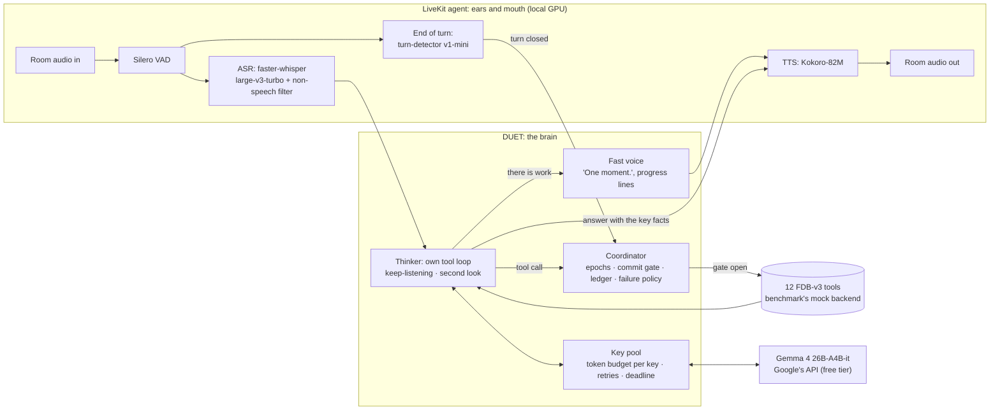

# DUET: an interruption-safe, dual-mind voice agent for Full-Duplex-Bench v3

**Samsung PRISM GenAI Hackathon 3.0 · Theme 05: Interruptible Real-Time Agents · Team SE7EN, SRM**

People interrupt, hesitate and correct themselves mid-sentence. Voice agents that
act on their behalf break exactly there. The Full-Duplex-Bench v3 paper
names the failure that costs every published system the most: *"models commit
intermediate parameters before the correction arrives."* Even the best system
(GPT-Realtime) fails over 40% of self-correction scenarios.

DUET is a custom LiveKit voice agent built around not doing that, without going
quiet while it waits:

- **Two minds.**
  - A **thinker**, **Gemma 4 26B-A4B-it** (Google's open-weights model, Apache 2.0),
    reasons over the whole request, calls the tools and speaks the outcome.
  - A **fast voice** covers the wait the moment there is work to do ("One
    moment."), gives progress on slow steps, and never claims a result it does not
    have.
- **One coordinator** decides *when acting is allowed*:
  - No tool runs while the user is still speaking, or before the turn has
    closed and the user has been quiet for a short hold. The hold is longer
    while they are revising ("no wait…") or mid-sentence ("…and").
  - A plan made on words the user has since changed is never carried out.
  - An identical action is never performed twice.
  - A failed read is retried once, and a failed or uncertain write is never
    blindly re-sent.

That maps onto the three capabilities the Theme 05 guide asks for:

| Guide | DUET |
|---|---|
| **Stay responsive**: no dead air, no false "done!" claims | The fast voice speaks while the thinker works. Nothing is announced as done before its tool result. A thinker failure still produces a spoken reply. |
| **Work asynchronously**: tools, perception and reasoning never block the conversation | Speech recognition, TTS, the model calls and every tool run off the audio loop. A progress line covers slow steps. |
| **Recover cleanly**: discard stale intent, update tool arguments, never repeat a state-changing action | Epochs discard plans made on words the user has since changed. The commit gate keeps stale values from reaching a tool. The idempotency ledger gives exactly-once actions, including when the user barges in mid-call. |

## Results

> Filled in from the reported run's `results/reported/<run>/summary.json`; the full
> run logs sit next to it (see [Run logs](#run-logs)).

| System (FDB-v3, 100 items) | Pass@1 | Tool F1 | Arg acc | Resp qual | Turn-take | Latency (task) | Interrupt |
|---|---|---|---|---|---|---|---|
| GPT-Realtime (paper) | 0.600 | 0.876 | 0.680 | 0.792 | 96.0% | 6.89 s | 13.5% |
| Gemini Live 3.1 (paper) | 0.540 | 0.817 | 0.588 | 0.718 | 78.0% | 4.25 s | 19.2% |
| Cascaded Whisper→GPT-4o→TTS (paper) | 0.450 | 0.803 | 0.562 | 0.600 | 100% | 10.12 s | 33.0% |
| **DUET, Gemma 4 26B-A4B (ours)** | *pending* | | | | | | |

**Listening alone, no model** (all 100 recordings through the official runner
and scripts, the agent answering "Okay." to every closed turn): every
conversation answered, 12% interruptions, and 4.09 s first-response latency as
the benchmark measures it, including its constant ~1.9 s recorder offset.
Record: [`results/reported/listening_dry_run`](results/reported/listening_dry_run).

## Architecture



Details, and why each piece exists: [docs/ARCHITECTURE.md](docs/ARCHITECTURE.md).

## Models and providers (declaration)

This is a **custom LiveKit agent**. It is not one of the benchmark's
realtime-provider presets.

| Role | Model | Where it runs |
|---|---|---|
| Thinker (reasoning, tool calls) | **Gemma 4 26B-A4B-it** (`gemma-4-26b-a4b-it`, open weights, Apache 2.0), with `gemma-4-31b-it` as the fallback if a key is not served the 26B. Sampling: Google's recommendation for Gemma 4 (temperature 1.0, top-p 0.95, top-k 64), seed 7. Gemma 4 always thinks before answering; the API takes no setting for it | **Google's API** (`google-genai` 2.25.0), free of charge on free-tier projects |
| Fast voice (acknowledgements, progress) | Fixed lines, no model: a hosted call takes seconds, too slow for a line that must come at once | Local |
| Speech recognition | `faster-whisper` large-v3-turbo (`mobiuslabsgmbh/faster-whisper-large-v3-turbo` @ `0a363e9`, CTranslate2, float16) | Local GPU |
| Text-to-speech | Kokoro-82M (`hexgrad/Kokoro-82M` @ `f3ff357`, voice `af_heart`) | Local GPU |
| Voice activity | Silero VAD (LiveKit plugin) | Local CPU |
| End of turn | LiveKit `turn-detector-v1-mini` (audio model in `livekit-local-inference`) | Local CPU |
| Tool backend | The benchmark's own `mock_apis.py`, unmodified | Local |
| Our own proxy judge (only without gpt-4o) | `gemma-4-31b-it`, labelled "PROXY judge" in every report | Google's API |

**Why Gemma 4 through Google's API.**
- **Samsung's preference, and strong at tools.** Gemma 4 26B-A4B is a
  mixture-of-experts model (25.2B parameters, 3.8B active per token) with native
  function calling; Google reports 68.2 on τ²-bench for it.
- **A light, dependable re-run.** Nothing large is downloaded or served locally: the
  GPU only runs speech (about 6 GB), well inside Samsung's 48 GB card.
- **Free.** Google serves Gemma free of charge on free-tier projects. The limit
  that matters is 16,000 input tokens per minute per model per project; a
  benchmark recording needs a few thousand. See [Rate limits](#rate-limits-and-robustness).

Every setting can be overridden (`DUET_THINKER_MODEL`, `DUET_TEMPERATURE`, and the
rest in `duet_voice/config.py`); each run records the effective values in
`run_config.json`.

## API keys: which ones, and where they go

Set them in the environment, or in `.env.local` at the repository root (git-ignored).
No key is included in this repository.

| Variable | Needed for | Required? |
|---|---|---|
| `GOOGLE_API_KEY` | Gemma 4 through Google's API. Create it at [aistudio.google.com](https://aistudio.google.com) (Get API key) **in a project without billing**: Google serves Gemma free on the free tier and lists it as "not available" on paid projects | **Yes** (or the next line) |
| `GOOGLE_API_KEYS` | Several keys, comma-separated. Keys from different projects add up their limits (16,000 input tokens per minute each); a call always goes to the key with the most room | Optional, recommended |
| `OPENAI_API_KEY` | The benchmark's gpt-4o judge (argument and response scoring, key-information latency). Without it our own reports use Gemma 4 31B as a labelled proxy judge | Optional |
| `LIVEKIT_URL`, `LIVEKIT_API_KEY`, `LIVEKIT_API_SECRET` | A LiveKit Cloud project. Without them, `reproduce.sh` downloads and runs a local LiveKit server (v1.13.7, checksum-verified) on free local ports | Optional |

## Reproduce the benchmark: one command

```bash
export GOOGLE_API_KEY=...        # or GOOGLE_API_KEYS=key1,key2,key3
bash scripts/doctor.sh           # optional: is this machine ready? (checks the key too)
bash reproduce.sh --only travel_19_695bd157114f0d2317f88617   # a quick check first
bash reproduce.sh --force        # all 100 items, then the three official evaluations
```

- **Target machine:** Linux x86_64 with an NVIDIA GPU (about 8 GB free is enough;
  Samsung's 48 GB card is plenty) and a driver for CUDA 12.x or 13.x, plus `git`,
  `curl`, internet access and about 30 GB of disk. No sudo and no system Python
  needed: a pinned `uv` supplies Python 3.11, and `ffmpeg` and the LiveKit server
  are fetched into `third_party/`.
- **Runtime:** about 2 hours. The benchmark streams every recording in real
  time, and each is about 47 s long. The first run also installs (about 15
  minutes) and downloads about 5 GB of speech models.
- **`--force`** re-runs recordings that already have a result (the runner skips
  them otherwise); use it on every full run after the quick check.

What the script does, in order:
1. Creates two Python environments with uv (Python 3.11), each from its lock file,
   so every package, direct and transitive, is at the version of our runs: `.venv`
   is the agent (`requirements.lock`), `.venv-bench` the benchmark's runner and
   scoring recognizer (`requirements-bench.lock`, with NVIDIA NeMo).
2. Clones Full-Duplex-Bench and checks out the pinned commit `3e799c4`.
3. Downloads the benchmark audio from the Google Drive link in the v3 README and
   verifies its SHA-256 (retried; an existing copy can be used via `FDB_DATA_DIR`).
4. Uses your LiveKit Cloud project, or starts a local LiveKit server on free ports.
5. Pre-downloads the speech models and the scoring recognizer, so the timed run is
   not a download.
6. Runs `bench/run_live.py`:
   - checks, in seconds, that every Google key can use Gemma 4 and that tool calling
     works (a key on a paid project, a wrong key or no network stops the run here,
     with the fix, instead of producing 100 failures);
   - starts the agent (`python -m duet_voice.agent start`);
   - runs the benchmark's **unmodified** `run_tool_benchmark_all_released.py
     --provider duet`;
   - runs its three evaluation scripts (`evaluate_tool_calls.py`,
     `evaluate_pass_rate.py`, `analyze_tool_latency.py`) with `--use-llm`;
   - prints the headline numbers and the GPU's peak memory.

### Running the agent under your own harness

The agent is an ordinary LiveKit worker, so it also runs under a harness other
than ours. It joins every new room in the LiveKit project (no agent name, no
explicit dispatch), so run only this worker in that project.

```bash
export LIVEKIT_URL=... LIVEKIT_API_KEY=... LIVEKIT_API_SECRET=... GOOGLE_API_KEY=...
.venv/bin/python -m duet_voice.prefetch          # once: download and warm the speech models
.venv/bin/python -m duet_voice.gemma_api         # the keys reach Gemma 4 and tool calling works
.venv/bin/python -m duet_voice.agent start       # FDB_V3_DIR=... if the benchmark is elsewhere
```

The worker is ready when its log shows `registered worker`. Then run the
benchmark's own runner and evaluations with `--provider duet` (or any name). Tool
calls go to `/tmp/agent_tool_calls.log` in the benchmark's format. The agent's tool
backend is the benchmark's own `mock_apis.py`, found in
`third_party/Full-Duplex-Bench/v3` (where `reproduce.sh` clones it) or in `FDB_V3_DIR`.

## Rate limits and robustness

Each benchmark recording gives the agent about 30 seconds after the request ends,
then the room closes; a model call that waits out a rate limit is a failed
recording. `duet_voice/gemma_api.py` is built for that:

- **A token budget per key and model** (`DUET_GEMMA_TPM`, 15,000 of the 16,000
  allowed): each call is booked before it is sent and waits for room rather than
  being refused. One DUET thinker call is about 2,300 input tokens, and a recording
  typically needs one to three.
- **Several keys** (`GOOGLE_API_KEYS`): each call goes to the key with the most room.
  If Google still refuses one (429), that key rests for the delay Google asks for
  and the call moves to another at once.
- **Fast retries** of Google's transient errors (500, 503, 504, timeouts), common
  on the free tier, within one deadline per call (`DUET_GEMMA_DEADLINE_S`, 20 s).
  A bad key, a model the key cannot use, or a malformed request fails at once.
- **No wasted calls:** planning during the user's pauses (LiveKit's preemptive
  generation) is off with a hosted model, and the fast voice needs no model.

## Run logs

Every run writes `results/live/<time>/` (git-ignored). The run we report is copied,
without audio, to the committed `results/reported/` folder with
`python bench/publish_run.py results/live/<time> --name <name>`:

| File | Content |
|---|---|
| `run_config.json` | The agent's effective settings (model, sampling, seed, number of API keys, token budget, listening thresholds), any `DUET_*`/`FDB_*` overrides, the LiveKit target, the scoring ASR, and the code version and machine. |
| `summary.json` | Headline metrics, plus what the agent did (thinker errors, keep-listening decisions, tool calls), the tokens used, and the GPU's peak memory. |
| `duet_evaluation_report.json`, `duet_pass_rate_report.json`, `duet_latency_report.json` | The benchmark's own reports. |
| `items/*.json` | The benchmark's per-item results: transcripts, tool calls, timings. |
| `traces/*.jsonl` | Our per-conversation trace: every heard segment, turn decision, thinker step, tool call with arguments and outcome, token usage, and STT/TTS/end-of-turn timings. |
| `agent.log`, `runner.log`, `eval_*.log` | Process logs. |

## Develop

```bash
python -m duet_voice.agent console          # talk to the agent with your own mic
python -m duet_voice.gemma_api              # which keys reach Gemma 4; does tool calling work
python bench/run_live.py --only travel_19   # one benchmark item, official scripts
python bench/run_live.py --dry-run          # no model, no key: checks listening and plumbing
python bench/offline_asr.py                 # what the agent's ears hear on all 100 inputs
python bench/offline_eval.py --judge        # the thinker alone on those transcripts, officially scored
python bench/offline_eval.py --text script --judge   # on the exact scripts: the reasoning ceiling
bash scripts/offline_eval.sh                # the same, on a machine set up by reproduce.sh
python bench/compare_runs.py                # one table of every evaluation, with code version and machine
python bench/failures.py results/offline/eval_<...>.json   # the failures, grouped by kind of mistake
python bench/cost_report.py results/live/<run>   # model calls and tokens, from the traces
python -m pytest tests -q
```

## Integrity and reproducibility

- **No benchmark item is written into the agent.** Prompts and tool schemas are
  written from general principles. `tests/test_voice_integrity.py` fails if any
  argument value the benchmark expects appears in any string the agent contains.
- **Nothing is cached across scenarios.** Each LiveKit room gets a fresh
  coordinator, toolbox and conversation state. No model is trained or tuned on
  the benchmark.
- **No calls to our own servers.** The only remote services are Google's API
  (the model) and, when a LiveKit Cloud project is used, LiveKit.
- **Pinned:**
  - every Python package, including transitive ones (`requirements*.lock`);
  - the benchmark commit, the data checksum and the LiveKit server version;
  - the exact Hugging Face revisions of the speech models;
  - the model (`gemma-4-26b-a4b-it`, open weights anyone can inspect or run),
    its sampling settings and a fixed seed on every call. A hosted model is served
    by Google, so repeated runs can differ slightly; the run logs record exactly
    what happened in ours.
- **Robust on someone else's machine.**
  - The preflight names the problem with a key before anything runs.
  - The local LiveKit server takes free ports and never reuses another user's.
  - Downloads and caches stay inside the repository folder.
- **Tool schemas.** Names, argument names and the call log format are the
  benchmark's. Arguments that a real API would treat as optional (for example an
  apartment budget) are optional here, rather than forcing the model to invent a
  value. Where the mock backend's Python signature needs such a value anyway, the
  adapter passes a neutral default, and the logged call keeps exactly what the
  agent asked for. See `duet_voice/fdb_tools.py`.

## Use-case extension: DUET for Galaxy

**The extension is the `app/` folder and `duet_voice/galaxy/`.** It is not used by the
benchmark run.

The same agent and coordinator run on a Samsung Galaxy phone as an Android app, in
three modes:
- **Assistant:** alarms corrected mid-sentence, battery troubleshooting you can
  interrupt, apps, settings, Maps and the home.
- **Care:** a companion for older people living alone, with a double-dose guard,
  family calls and check-ins.
- **Drive:** route changes mid-sentence, arrival-time messages, the home from the car.

Every phone action goes over LiveKit RPC through the same commit gate and ledger,
plus two guards added for real users:
- a **consent gate**: a change the user did not ask for is offered, not made;
- a **second look before speaking**: the answer is checked against the actions
  that really ran.

The app shows DUET's steps live ("Never ran", "Done", "Asked first"). How to build
it, run it and record the demo: [app/README.md](app/README.md). The use-case
research behind it: [docs/USE_CASE_RESEARCH.md](docs/USE_CASE_RESEARCH.md).

## Repository map

```
duet_voice/        the agent: LiveKit entrypoint, thinker, fast voice, coordinator, tools, speech models
duet_voice/gemma_api.py   Gemma 4 through Google's API: key pool, token budget, retries, preflight
duet_voice/galaxy/ the use-case extension's agent (phone tools over LiveKit RPC, three modes)
bench/             benchmark drivers: live runner, offline evaluators, judge adapter, reports
scripts/           machine check, fast offline evaluation, the extension's demo tools
app/               the extension: DUET for Galaxy (Android app, web build, demo recorder)
tests/             coordinator, key pool, speaking-flow, phone-bridge and integrity tests
docs/              architecture, requirements checklist, findings, use-case research
reproduce.sh       one-command reproduction
legacy/kit_v1/     the previous Theme 05 kit and DUET v1 (research record, not used)
```

## References

- G.-T. Lin, C. Chen, Z. Chen, H.-y. Lee. *Full-Duplex-Bench-v3: Benchmarking Tool Use
  for Full-Duplex Voice Agents Under Real-World Disfluency.* arXiv:2604.04847, 2026.
  Code and data: <https://github.com/DanielLin94144/Full-Duplex-Bench> (v3).
- Gemma 4: <https://ai.google.dev/gemma> · Google's API: <https://ai.google.dev> ·
  LiveKit Agents: <https://github.com/livekit/agents> · faster-whisper:
  <https://github.com/SYSTRAN/faster-whisper> · Kokoro-82M:
  <https://huggingface.co/hexgrad/Kokoro-82M> · Silero VAD:
  <https://github.com/snakers4/silero-vad>.
