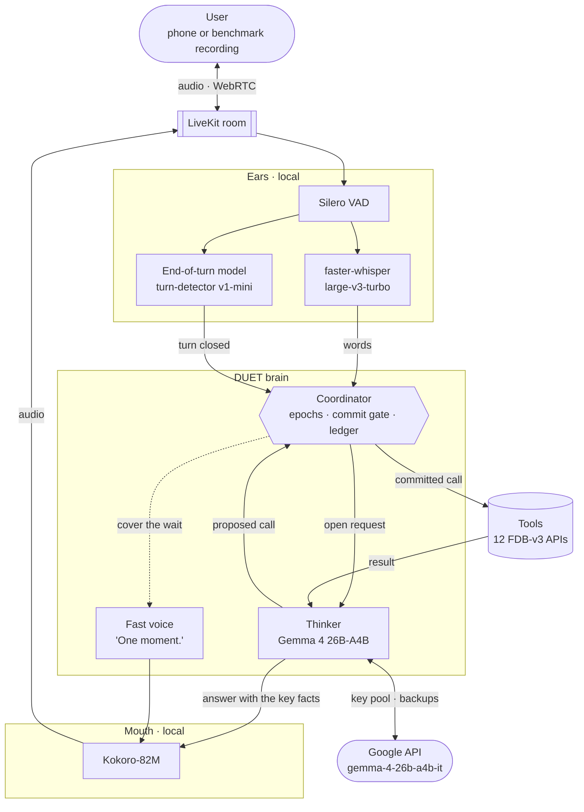
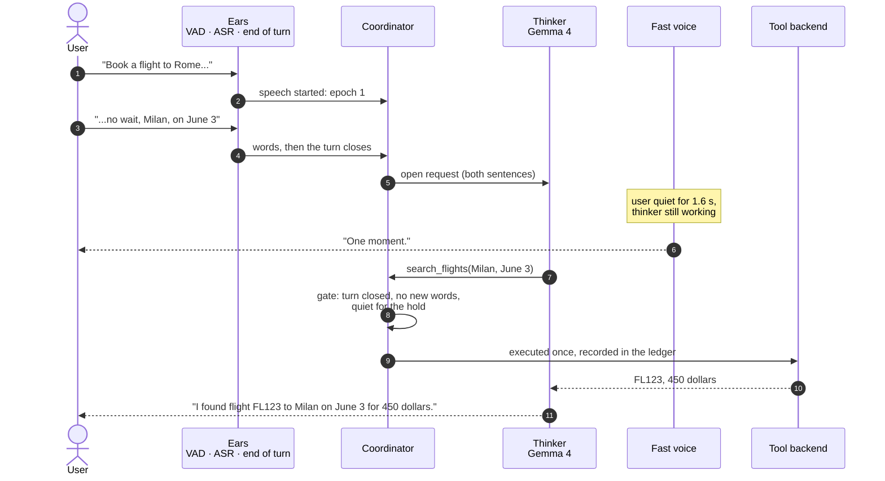
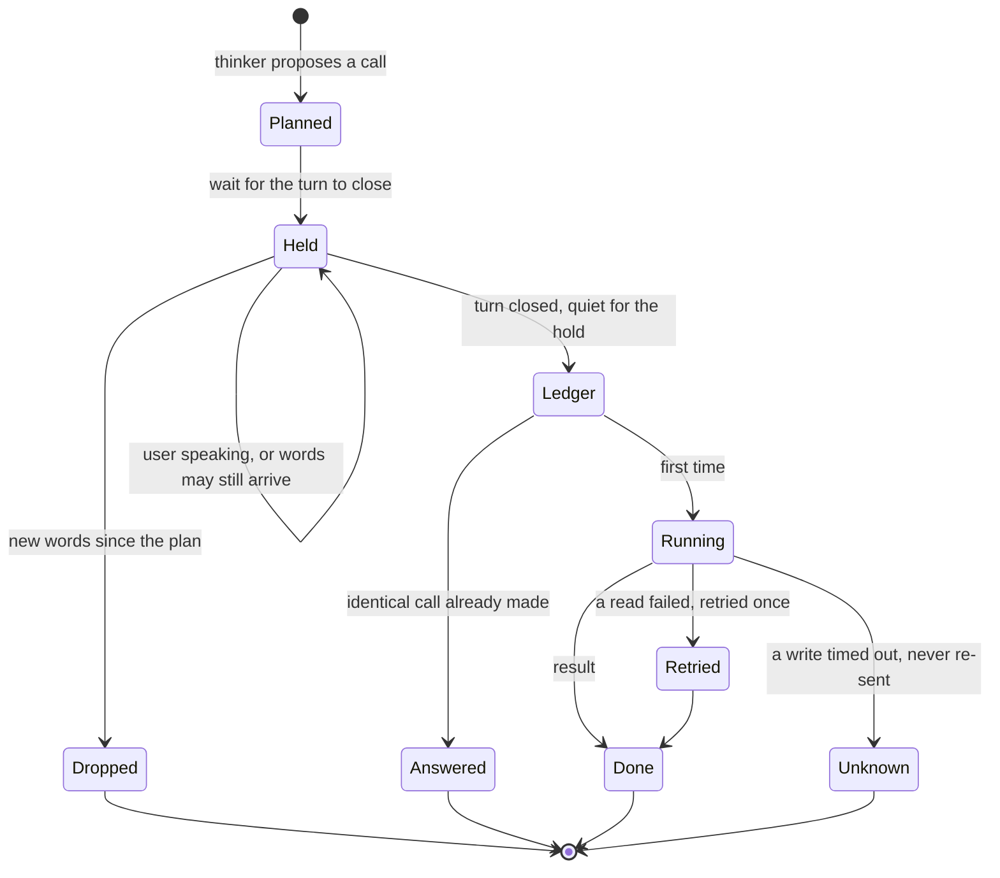
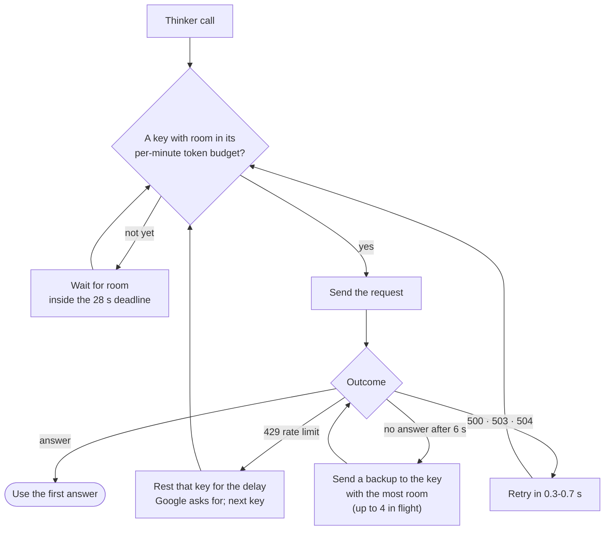
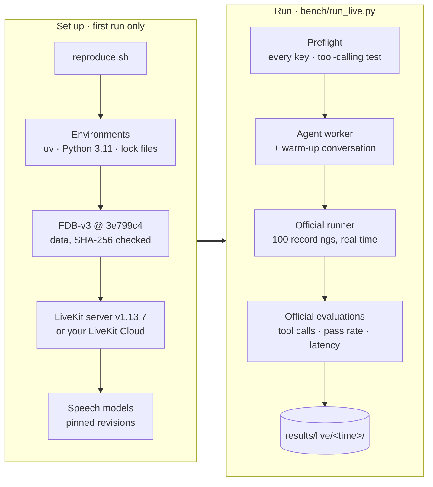
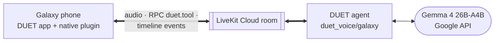

# DUET: a full-duplex voice agent that acts on what you mean

**Samsung PRISM GenAI Hackathon 3.0 · Theme 05: Interruptible Real-Time Agents · Team SE7EN, SRM**

People interrupt, hesitate and correct themselves mid-sentence: *"Book a flight to
Rome, no wait, Milan."* A voice agent that acts on their behalf fails exactly there.
The Full-Duplex-Bench v3 paper names the failure that costs every published system
the most: *"models commit intermediate parameters before the correction arrives."*

**DUET** is a LiveKit voice agent built so that this cannot happen, without going
quiet while it waits. It pairs two minds, a fast voice that keeps the conversation
alive and a thinker (**Gemma 4 26B-A4B**) that reasons over the whole request and
calls the tools, with a **coordinator** that decides *when acting is allowed*.

| | |
|---|---|
| **Benchmark** | Full-Duplex-Bench v3: 100 real recordings, 12 tools, four domains, the official runner and scripts |
| **Language model** | Gemma 4 26B-A4B-it (open weights, Apache 2.0) through Google's API |
| **Speech** | faster-whisper large-v3-turbo, Silero VAD, LiveKit end-of-turn model, Kokoro-82M, all local |
| **Use-case extension** | DUET for Galaxy: the same agent on a Samsung phone, in three modes ([`app/`](app/README.md)) |
| **Reproduction** | One command, `bash reproduce.sh` ([below](#reproduce-the-benchmark)) |

## Results

Full-Duplex-Bench v3, all 100 recordings, streamed in real time through the
benchmark's own runner and scored by its own scripts. The complete record of the run,
with every trace and log, is in [`results/reported/gemma4_final_run`](results/reported/gemma4_final_run).

| System | Pass@1 | Tool selection | Argument accuracy | Response quality | Turn-take | Task latency | Interruptions |
|---|---|---|---|---|---|---|---|
| **DUET, Gemma 4 26B-A4B (ours)** | **0.81** | **0.915** | **0.850** | **0.730** | **100%** | **14.44 s** | **0%** |
| GPT-Realtime (paper) | 0.600 | 0.876 | 0.680 | 0.792 | 96.0% | 6.89 s | 13.5% |
| Gemini Live 3.1 (paper) | 0.540 | 0.817 | 0.588 | 0.718 | 78.0% | 4.25 s | 19.2% |
| Cascaded Whisper → GPT-4o → TTS (paper) | 0.450 | 0.803 | 0.562 | 0.600 | 100% | 10.12 s | 33.0% |

Scored by the benchmark's own scripts on our laptop (RTX 3060, Windows) with two disclosed stand-ins: the LLM judge is Gemma 4 26B-A4B answering the official gpt-4o prompts unchanged, and faster-whisper transcribes DUET's own speech in place of the Linux-only Parakeet (this affects response quality and latency, not the tool metrics). With no judge at all, by exact match, DUET passes 75 of 100. Samsung's re-run uses the official gpt-4o judge and Parakeet.

How we measured, what the remaining misses are, and how DUET behaves on each kind of
disfluency: [docs/RESULTS.md](docs/RESULTS.md).

## How DUET works



- **The ears** turn the room audio into words and decide when a turn has ended. They
  never decide what to do.
- **The thinker** sees the *open request*, everything the user has said since the last
  answer that was actually spoken, so a correction that arrives as a separate
  sentence is always read together with what it corrects. It runs its own tool loop
  and speaks once, after the tools, with the facts from their results.
- **The fast voice** covers the wait with a fixed line once the user has clearly
  finished ("One moment.", then "Still working on it." on long chains). It never
  names a value, because the user may still be correcting it, and never claims a
  result.
- **The coordinator** owns every action. No tool runs while the user is speaking or
  before the turn has closed and the user has been quiet for a short hold, and a
  plan made on words the user has since changed is never carried out.

### One turn, with a self-correction



Had the user spoken again at step 8 ("...actually, June 4"), the call would have
waited at the gate while they spoke and been dropped the moment their new words
arrived. The next turn re-reads everything and plans again. A cough or a burst of
room noise, which brings no words, only delays the call.

### The coordinator: when an action may run



| Mechanism | What it guarantees |
|---|---|
| **Epochs** | Every call carries the epoch of the words its plan was made on. Once the user says anything new, older plans are void, even after the newer turn has closed. |
| **Commit gate** | A tool runs only after the turn has closed and the user has been quiet for 1.1 s, 1.8 s while they have been revising ("no wait", "actually"), 2.2 s when their last words leave a sentence open ("and...", "um"). |
| **Idempotency ledger** | An identical call already made in the conversation is answered from the ledger: a state-changing action never happens twice, even when the user barges in mid-call. |
| **Failure policy** | A failed read is retried once. A failed or timed-out write is never blindly re-sent; the user is told and offered a human agent. |
| **Keep listening** | When the words are cut off mid-sentence, or announce a detail still to come ("the order number is..."), the thinker calls `keep_listening`: nothing is said or done until the user has been quiet for 2.5 s. |

The full design, with the reasoning behind every threshold:
[docs/ARCHITECTURE.md](docs/ARCHITECTURE.md).

## Reliable model calls

Each benchmark recording gives the agent about 30 seconds after the request before
the room closes, so a model call must never be lost to a rate limit, a transient
error or a request that stalls. Every call goes through `duet_voice/gemma_api.py`:



- **Several keys** (`GOOGLE_API_KEYS`) add up their limits; each call goes to the key
  with the most room.
- **A token budget per key and model** (15,000 of Google's 16,000 input tokens per
  minute): a call is booked before it is sent and waits for room instead of being
  refused.
- **Backup requests** for stalls: answers take about 3 s at the median; a request with
  no answer after 6 s is not abandoned, a second one goes out, and the first answer
  wins.
- **No wasted calls**: a turn that closed while its last words were still being
  transcribed waits for them before the model is called, and nothing is planned
  during the user's pauses.
- **Visible**: every request is logged in `agent.log` with its key, time and tokens.

## Models and providers (declaration)

DUET is a **custom LiveKit agent**, not one of the benchmark's realtime-provider presets.

| Role | Model | Where it runs |
|---|---|---|
| Thinker: reasoning and tool calls | **Gemma 4 26B-A4B-it** (`gemma-4-26b-a4b-it`), open weights, Apache 2.0. `gemma-4-31b-it` is the fallback if a key is not served the 26B. Sampling as Google recommends for Gemma 4 (temperature 1.0, top-p 0.95, top-k 64), seed 7 on every call | Google's API (`google-genai` 2.25.0) |
| Fast voice | Fixed lines, no model | Local |
| Speech recognition | faster-whisper large-v3-turbo (`mobiuslabsgmbh/faster-whisper-large-v3-turbo` @ `0a363e9`, float16) | Local GPU |
| Voice activity | Silero VAD (LiveKit plugin) | Local CPU |
| End of turn | LiveKit `turn-detector-v1-mini` (audio model) | Local CPU |
| Text-to-speech | Kokoro-82M (`hexgrad/Kokoro-82M` @ `f3ff357`, voice `af_heart`) | Local GPU |
| Tool backend | The benchmark's own `mock_apis.py`, unmodified | Local |
| LLM judge | The benchmark's gpt-4o when an `OPENAI_API_KEY` is set; otherwise Gemma 4 26B-A4B answers the same prompts and every report says so | OpenAI / Google |

**Why Gemma 4 26B-A4B.** A mixture-of-experts model (25.2B parameters, 3.8B active per
token) with native function calling, strong on tool use (68.2 on τ²-bench), and open
weights anyone can inspect. Served through Google's API, the re-run downloads no large
model: the GPU runs only the speech models, a few GB, far inside Samsung's 48 GB card.

## Reproduce the benchmark

```bash
export GOOGLE_API_KEYS=key1,key2        # or GOOGLE_API_KEY=key (also read from .env.local)
bash scripts/doctor.sh                  # optional: is this machine ready? (checks the keys too)
bash reproduce.sh --only travel_19_695bd157114f0d2317f88617   # a two-minute check
bash reproduce.sh --force               # all 100 recordings, then the three official evaluations
```



- **Machine:** Linux x86_64, an NVIDIA GPU with about 8 GB free and a CUDA 12.x or 13.x
  driver, 16 GB of RAM or more (loading the benchmark's NeMo scoring recognizer takes
  several GB on top of the agent's own), `git`, `curl`, internet access, about 30 GB of
  disk. No sudo, no system Python: a pinned `uv` supplies Python 3.11; ffmpeg and the
  LiveKit server are fetched into `third_party/`.
- **Time:** about two hours for all 100 recordings (the benchmark streams each one in
  real time), plus about 15 minutes of installation on the first run.
- **What it runs:** the benchmark's **unmodified** `run_tool_benchmark_all_released.py
  --provider duet`, then its three evaluation scripts with `--use-llm`, and prints the
  headline numbers and the GPU's peak memory.
- **`--force`** re-runs recordings that already have a result; use it on every full run
  after the quick check.

### API keys

No key is included in this repository. Set them in the environment or in `.env.local`
at the repository root (git-ignored).

| Variable | Purpose | Required |
|---|---|---|
| `GOOGLE_API_KEY` | Gemma 4 through Google's API. Create one at [aistudio.google.com](https://aistudio.google.com) (Get API key) **in a project without billing**: Google serves Gemma free of charge on the free tier. The preflight tests every key before the run starts and names any problem | **Yes** (or the next line) |
| `GOOGLE_API_KEYS` | Several keys, comma-separated, each from a different project without billing. Their per-minute limits add up; two or three are recommended for a full run | Recommended |
| `OPENAI_API_KEY` | The benchmark's gpt-4o judge (argument and response scoring, key-information latency) | Optional |
| `LIVEKIT_URL`, `LIVEKIT_API_KEY`, `LIVEKIT_API_SECRET` | A LiveKit Cloud project instead of the local LiveKit server | Optional |

### In a container

The [`Dockerfile`](Dockerfile) runs the same `reproduce.sh` on a clean Ubuntu 22.04 image,
adding only the tools the script expects (git, curl, xz). It needs the NVIDIA Container
Toolkit on the host.

```bash
docker build -t duet .
docker run --rm --gpus all --shm-size 8g -e GOOGLE_API_KEYS=key1,key2 \
  -v duet-cache:/duet/third_party -v "$PWD/results/live:/duet/results/live" \
  duet --only travel_19_695bd157114f0d2317f88617        # or --force for all 100 recordings
```

### Network access

For a machine behind a firewall, these are every host the reproduction contacts:

| Host | What for | When |
|---|---|---|
| `generativelanguage.googleapis.com` | Gemma 4, the language model | Every run |
| `api.openai.com` | The official gpt-4o judge, when `OPENAI_API_KEY` is set | Evaluation |
| `pypi.org`, `files.pythonhosted.org` | Python packages, from the lock files | First run |
| `huggingface.co` and its download hosts (`*.huggingface.co`, `*.hf.co`) | The speech models and the benchmark's Parakeet recognizer | First run |
| `github.com` and its download hosts (`objects.githubusercontent.com`, `release-assets.githubusercontent.com`) | Full-Duplex-Bench, the LiveKit server, ffmpeg, Python 3.11 builds, one spaCy model | First run |
| `astral.sh`, `releases.astral.sh` | The pinned `uv`, if it is not installed | First run |
| `drive.usercontent.google.com` | The benchmark audio, unless `FDB_DATA_DIR` points at a copy | First run |

`bash scripts/doctor.sh` checks that the main one in each row can be reached (all but the
optional judge's).

### Run it under your own harness

The agent is an ordinary LiveKit worker. It joins every new room in the project (no
agent name, no explicit dispatch), so run only this worker there.

```bash
.venv/bin/python -m duet_voice.prefetch        # once: download and warm the speech models
.venv/bin/python -m duet_voice.gemma_api       # the keys reach Gemma 4 and tool calling works
.venv/bin/python -m duet_voice.agent start     # ready when the log shows "registered worker"
```

Then run the benchmark's own runner and evaluations with `--provider duet`. Tool calls
go to `/tmp/agent_tool_calls.log` in the benchmark's format.

## Run logs

Every run writes `results/live/<time>/`; the run reported above is copied, without
audio, to [`results/reported/`](results/reported/) by `bench/publish_run.py`.

| File | Content |
|---|---|
| `run_config.json` | The agent's effective settings (model, sampling, seed, keys, token budget, listening thresholds), overrides, the LiveKit target, the scoring recognizer, the code version and the machine |
| `summary.json` | Headline metrics, what the agent did (keep-listening decisions, tool calls, model errors), tokens, and the GPU's peak memory |
| `duet_*_report.json` | The benchmark's own evaluation, pass-rate and latency reports |
| `items/*.json` | The benchmark's per-recording results: transcripts, tool calls, timings |
| `traces/*.jsonl` | DUET's own trace of each conversation: every heard segment, turn decision, thinker step, tool call with arguments and outcome, token counts, and speech timings |
| `agent.log`, `runner.log`, `eval_*.log` | Process logs, including one line per model request |

## Use-case extension: DUET for Galaxy

**The extension lives in [`app/`](app/README.md) and [`duet_voice/galaxy/`](duet_voice/galaxy).**
It is not used by the benchmark run.

The same agent, coordinator and model run behind an Android app on a Samsung Galaxy
phone, in three modes:

| Mode | For whom | What it shows |
|---|---|---|
| **Assistant** | Every Galaxy owner | An alarm corrected mid-sentence; battery troubleshooting from the phone's real readings that you can interrupt; apps, settings, Maps and the home |
| **Care** | An older person living alone, and their family | Medicines with a double-dose guard, calls and messages to family, reminders, a daily check-in |
| **Drive** | A driver, eyes on the road | A destination changed mid-sentence, arrival-time messages, the car's climate, the home from the car |



Every phone action passes the same coordinator as in the benchmark, and the app shows
each step live: **Planned**, **Never ran** (a plan the user's correction overtook),
**Done**, **Not repeated**. Real Android interfaces handle alarms, battery and screen
readings, installed apps, brightness, settings screens, Maps navigation, calls and
messages; the smart home, the medicine schedule and the car are simulated inside the
app. Build, run and demo instructions: [app/README.md](app/README.md).

## Engineering quality

- **75 unit tests** (`python -m pytest tests -q`): the coordinator's gate, epochs and
  ledger; the key pool, backups and deadlines; the speaking rules; tool argument
  handling; the phone bridge.
- **No benchmark item is written into the agent.** `tests/test_voice_integrity.py`
  fails if any argument value the benchmark expects appears in any string the agent
  contains. Prompts and tool schemas are written from general principles, and nothing
  is trained or tuned on the benchmark.
- **Nothing is cached across scenarios.** Each LiveKit room gets a fresh coordinator,
  toolbox and conversation.
- **Pinned:** every Python package including transitive ones (`requirements*.lock`),
  the benchmark commit, the data checksum, the LiveKit server version, the Hugging Face
  revisions of the speech models, the model name, its sampling and a fixed seed.
- **Robust on someone else's machine:** the preflight names any problem with a key
  before anything runs; the local LiveKit server takes free ports and never reuses
  another user's; downloads and caches stay inside the repository folder.
- **Tool schemas** keep the benchmark's names, arguments and log format. Arguments a
  real API treats as optional stay optional, and values are cleaned the way an API
  takes them (numbers as numbers, dates as month and day, spelled-out ids joined).

## Repository map

```
duet_voice/              the agent
  agent.py               LiveKit entrypoint: ears, fast voice, the turn loop
  coordinator.py         epochs, commit gate, idempotency ledger, failure policy
  thinker.py             Gemma 4 tool loop, keep-listening
  gemma_api.py           key pool, token budget, retries, backup requests, preflight
  fdb_tools.py           the 12 FDB-v3 tools over the benchmark's mock backend
  prompts.py             the thinker's instructions
  galaxy/                the use-case extension's agent: phone tools, three modes
bench/                   live runner, warm-up, offline evaluators, judge adapter, reports
scripts/                 machine check, offline evaluation, the extension's demo tools
app/                     DUET for Galaxy: Android app, web build, demo recorder
tests/                   75 unit tests
docs/                    architecture, results, engineering notes, requirements, research
results/reported/        the reported run: reports, traces and logs
reproduce.sh             one-command reproduction
legacy/                  DUET v1 on the original Theme 05 kit (research record, not used)
```

## Documentation

| Document | What it covers |
|---|---|
| [SRM_SE7EN.pptx](SRM_SE7EN.pptx) · [SRM_SE7EN.pdf](SRM_SE7EN.pdf) | The presentation: problem, architecture, the coordinator, tech stack, results, the extension, limitations and next steps (8 slides) |
| [SRM_SE7EN_Documentation.pdf](SRM_SE7EN_Documentation.pdf) | Everything in one document, starting with each of Samsung's requirements and where it is met |
| [docs/ARCHITECTURE.md](docs/ARCHITECTURE.md) | Every component, the turn lifecycle, the coordinator, the model client, the tools, with diagrams |
| [docs/RESULTS.md](docs/RESULTS.md) | The reported run in detail: metrics, breakdowns, the remaining misses |
| [docs/ENGINEERING_NOTES.md](docs/ENGINEERING_NOTES.md) | How the benchmark scores, what we measured, and the decisions each measurement led to |
| [docs/SAMSUNG_REQUIREMENTS.md](docs/SAMSUNG_REQUIREMENTS.md) | Each line of the Theme 05 guide and where it is met |
| [docs/USE_CASE_RESEARCH.md](docs/USE_CASE_RESEARCH.md) | The research behind the extension |
| [app/README.md](app/README.md) | DUET for Galaxy: build, run, demo |
| [docs/VIDEO_SCRIPT.md](docs/VIDEO_SCRIPT.md) | The demo video's plan |
| [docs/deck/](docs/deck/) | How the presentation and this documentation are built from the repository |

## References

- G.-T. Lin, C. Chen, Z. Chen, H.-y. Lee. *Full-Duplex-Bench-v3: Benchmarking Tool Use for
  Full-Duplex Voice Agents Under Real-World Disfluency.* arXiv:2604.04847, 2026. Code and
  data: <https://github.com/DanielLin94144/Full-Duplex-Bench> (v3).
- Gemma 4: <https://ai.google.dev/gemma> · LiveKit Agents: <https://github.com/livekit/agents> ·
  faster-whisper: <https://github.com/SYSTRAN/faster-whisper> · Kokoro-82M:
  <https://huggingface.co/hexgrad/Kokoro-82M> · Silero VAD: <https://github.com/snakers4/silero-vad>
