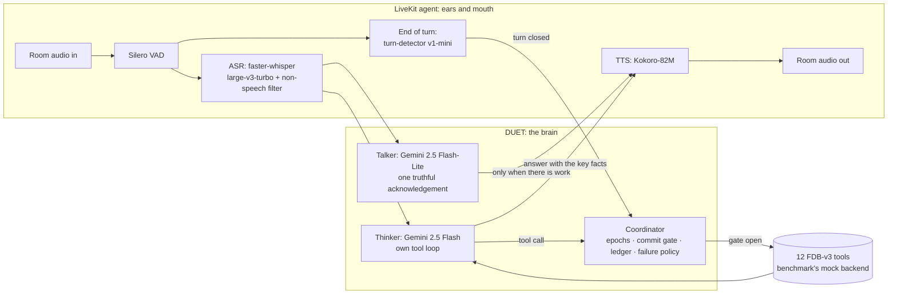

# DUET: an interruption-safe, dual-mind voice agent for Full-Duplex-Bench v3

**Samsung PRISM GenAI Hackathon 3.0 · Theme 05: Interruptible Real-Time Agents · Team SE7EN, SRM**

People interrupt, hesitate and correct themselves mid-sentence. Voice agents that
act on their behalf break exactly there. The Full-Duplex-Bench v3 paper
names the failure that costs every published system the most: *"models commit
intermediate parameters before the correction arrives."* Even the best system
(GPT-Realtime) fails over 40% of self-correction scenarios.

DUET is a custom LiveKit voice agent built around not doing that, without going
quiet while it waits:

- **Two minds.**
  - A **talker** (a fast model) acknowledges the user the moment there is work
    to cover, and never claims a result it doesn't have.
  - A **thinker** (a reasoning model with the tools) plans, calls tools and
    speaks the outcome.
- **One coordinator** decides *when acting is allowed*:
  - No tool runs while the user is still speaking, or before the turn has
    closed and the user has been quiet for a short hold. The hold is longer
    while they are revising ("no wait…") or mid-sentence ("…and").
  - An identical action is never performed twice.
  - A failed read is retried once, and a failed or uncertain write is never
    blindly re-sent.

That maps onto the three capabilities the Theme 05 guide asks for:

| Guide | DUET |
|---|---|
| **Stay responsive**: no dead air, no false "done!" claims | The talker speaks while the thinker works. Nothing is announced as done before its tool result. A thinker failure still produces a spoken reply. |
| **Work asynchronously**: tools, perception and reasoning never block the conversation | Speech recognition, TTS and every tool run off the audio loop. Tools run while the acknowledgement plays, and a progress line covers slow tools. |
| **Recover cleanly**: discard stale intent, update tool arguments, never repeat a state-changing action | Epochs discard plans made on words the user has since changed. The commit gate keeps stale values from reaching a tool. The idempotency ledger gives exactly-once actions, including when the user barges in mid-call. |

## Results

> Filled in from the reported run's `results/live/<run>/summary.json`; the full
> run logs sit next to it (see [Run logs](#run-logs)).

| System (FDB-v3, 100 items) | Pass@1 | Tool F1 | Arg acc | Resp qual | Turn-take | Latency (task) | Interrupt |
|---|---|---|---|---|---|---|---|
| GPT-Realtime (paper) | 0.600 | 0.876 | 0.680 | 0.792 | 96.0% | 6.89 s | 13.5% |
| Gemini Live 3.1 (paper) | 0.540 | 0.817 | 0.588 | 0.718 | 78.0% | 4.25 s | 19.2% |
| Cascaded Whisper→GPT-4o→TTS (paper) | 0.450 | 0.803 | 0.562 | 0.600 | 100% | 10.12 s | 33.0% |
| **DUET (ours)** | *pending* | | | | | | |

## Architecture



Details, and why each piece exists: [docs/ARCHITECTURE.md](docs/ARCHITECTURE.md).

## Models and providers (declaration)

This is a **custom LiveKit agent**. It is not one of the benchmark's
realtime-provider presets.

| Role | Model | Where it runs |
|---|---|---|
| Thinker (reasoning, tool calls) | Google `gemini-2.5-flash` (thinking budget 512, temperature 0, seed 7) | Gemini API (hosted) |
| Talker (acknowledgements) | Google `gemini-2.5-flash-lite` (thinking off, temperature 0, seed 7) | Gemini API (hosted) |
| Speech recognition | `faster-whisper` large-v3-turbo (`mobiuslabsgmbh/faster-whisper-large-v3-turbo` @ `0a363e9`, CTranslate2, float16) | Local GPU |
| Text-to-speech | Kokoro-82M (`hexgrad/Kokoro-82M` @ `f3ff357`, voice `af_heart`) | Local GPU |
| Voice activity | Silero VAD (LiveKit plugin) | Local CPU |
| End of turn | LiveKit `turn-detector-v1-mini` (audio model in `livekit-local-inference`) | Local CPU |
| Tool backend | The benchmark's own `mock_apis.py`, unmodified | Local |

Local models use about 4 GB of GPU memory, far below the 48 GB evaluation GPU.
The thinker and talker are Gemini-only today. A backend for open-weight models
on the same GPU (for example Gemma served by vLLM) is future work: the
thinker's tool loop is the only piece that would change.

## API keys: which ones, and where they go

Set these as environment variables, or put them in `.env.local` at the
repository root (the file is git-ignored). No key is included in this
repository.

| Variable | Needed for | Required? |
|---|---|---|
| `GOOGLE_API_KEY` | DUET's thinker and talker (Gemini API). Alternatively Vertex AI: `GOOGLE_GENAI_USE_VERTEXAI=true`, `GOOGLE_CLOUD_PROJECT`, `GOOGLE_CLOUD_LOCATION`, and application-default credentials | **Yes** |
| `OPENAI_API_KEY` | The benchmark's gpt-4o judge (argument and response scoring, key-information latency) | For judged scores |
| `LIVEKIT_URL`, `LIVEKIT_API_KEY`, `LIVEKIT_API_SECRET` | A LiveKit Cloud project. Without them, `reproduce.sh` downloads and runs a local LiveKit server (v1.13.7, checksum-verified) in dev mode | Optional |

## Reproduce the benchmark: one command

```bash
export GOOGLE_API_KEY=...        # required
export OPENAI_API_KEY=...        # the official gpt-4o judge
bash reproduce.sh                # all 100 items, then the three official evaluations
bash reproduce.sh --only travel_19,housing_04   # a quick subset
```

- **Target machine:** Linux x86_64, one NVIDIA GPU (CUDA 12 or 13 driver), with
  `ffmpeg`, `git`, `curl` and `unzip` installed. Python 3.10-3.12 (3.11 preferred,
  the version of our runs). If there is none, or the `venv` module is missing
  (stock Ubuntu without `python3-venv`), the script uses a pinned `uv` to create
  the environments and, if needed, to supply Python 3.11.
- **Runtime:** about 2 hours. The benchmark streams every recording in real
  time, and each is about 47 s long.

What the script does, in order:
1. Creates two virtual environments and installs each from its lock file, so
   every package, direct and transitive, is at the version of our runs:
   `.venv` for the agent (`requirements.lock`, from `requirements.txt`) and
   `.venv-bench` for the benchmark runner (`requirements-bench.lock`, from
   `requirements-bench.txt`, with NVIDIA NeMo for the scoring ASR). Both use the
   CUDA 12.8 build of torch 2.10, which runs on CUDA 12.x and 13.x drivers.
2. Clones Full-Duplex-Bench and checks out the pinned commit `3e799c4`.
3. Downloads the benchmark audio from the Google Drive link in the v3 README and
   verifies its SHA-256.
4. Uses your LiveKit Cloud project, or starts a local LiveKit dev server.
5. Pre-downloads every model, so the timed run is not a download.
6. Runs `bench/run_live.py`:
   - starts the agent (`python -m duet_voice.agent start`);
   - runs the benchmark's **unmodified** `run_tool_benchmark_all_released.py
     --provider duet`;
   - runs its three evaluation scripts (`evaluate_tool_calls.py`,
     `evaluate_pass_rate.py`, `analyze_tool_latency.py`) with `--use-llm`;
   - prints the headline numbers.

### Running the agent under your own harness

The agent is an ordinary LiveKit worker, so it also runs under a harness other
than ours. It joins every new room in the LiveKit project (no agent name, no
explicit dispatch), so run only this worker in that project.

```bash
export GOOGLE_API_KEY=... LIVEKIT_URL=... LIVEKIT_API_KEY=... LIVEKIT_API_SECRET=...
.venv/bin/python -m duet_voice.prefetch          # once: download and warm the models
.venv/bin/python -m duet_voice.agent start      # FDB_V3_DIR=... if the benchmark is elsewhere
```

The worker is ready when its log shows `registered worker` and `ready in`. Then
run the benchmark's own runner and evaluations with `--provider duet` (or any
name). Tool calls go to `/tmp/agent_tool_calls.log` in the benchmark's format.
The agent's tool backend is the benchmark's own `mock_apis.py`, found in
`third_party/Full-Duplex-Bench/v3` (where `reproduce.sh` clones it) or in `FDB_V3_DIR`.

## Run logs

Every run writes `results/live/<time>/`:

| File | Content |
|---|---|
| `run_config.json` | Every `DUET_*`/`FDB_*` setting, the LiveKit target and the scoring ASR. |
| `summary.json` | Headline metrics, plus what the agent did (thinker errors, keep-listening decisions, talker lines, tool calls) and the Gemini tokens and cost of the run. |
| `duet_evaluation_report.json`, `duet_pass_rate_report.json`, `duet_latency_report.json` | The benchmark's own reports. |
| `items/*.json` | The benchmark's per-item results: transcripts, tool calls, timings. |
| `traces/*.jsonl` | Our per-conversation trace: every heard segment, turn decision, talker line, thinker step, tool call with arguments and outcome, token usage, and STT/TTS/end-of-turn timings. |
| `agent.log`, `runner.log`, `eval_*.log` | Process logs. |

## Develop

```bash
python -m duet_voice.agent console          # talk to the agent with your own mic
python bench/run_live.py --only travel_19   # one benchmark item, official scripts
python bench/run_live.py --dry-run          # no model, no key: checks listening and plumbing
python bench/offline_asr.py                 # what the agent's ears hear on all 100 inputs
python bench/offline_eval.py --judge        # the thinker alone on those transcripts, officially scored
python bench/cost_report.py results/live/<run>   # Gemini tokens and dollars, from the traces
python -m pytest tests -q
```

## Integrity and reproducibility

- **No benchmark item is written into the agent.** Prompts and tool schemas are
  written from general principles. `tests/test_voice_integrity.py` fails if any
  argument value the benchmark expects appears in any string the agent contains.
- **Nothing is cached across scenarios.** Each LiveKit room gets a fresh
  coordinator, toolbox and conversation state. Only model weights are shared.
- **No calls to our own servers.** The only remote services are the Gemini API and
  LiveKit.
- **Pinned:**
  - every Python package, including transitive ones (`requirements*.lock`);
  - the benchmark commit, the data checksum and the LiveKit server version;
  - the exact Hugging Face snapshots of the speech models;
  - sampling (temperature 0, seed 7) and greedy speech recognition.
- **Transient API errors are retried.** A rate limit or a brief server error
  from the Gemini API is retried with backoff (up to three times), so it does not
  fail a conversation on the re-run machine.
- **Tool schemas.** Names, argument names and the call log format are the
  benchmark's. Arguments that a real API would treat as optional (for example an
  apartment budget) are optional here, rather than forcing the model to invent a
  value. Where the mock backend's Python signature needs such a value anyway, the
  adapter passes a neutral default, and the logged call keeps exactly what the
  agent asked for. See `duet_voice/fdb_tools.py`.

## Use-case extension

*In progress: this section will mark the extension, its code and how to run it.*
Research behind the choice: [docs/USE_CASE_RESEARCH.md](docs/USE_CASE_RESEARCH.md).

## Repository map

```
duet_voice/        the agent: LiveKit entrypoint, talker, thinker, coordinator, tools, speech models
bench/             benchmark drivers: live runner, offline evaluators, judge adapter
tests/             coordinator, speaking-flow and integrity tests
docs/              architecture, use-case research
reproduce.sh       one-command reproduction
legacy/kit_v1/     the previous Theme 05 kit and DUET v1 (research record, not used)
```

## References

- G.-T. Lin, C. Chen, Z. Chen, H.-y. Lee. *Full-Duplex-Bench-v3: Benchmarking Tool Use
  for Full-Duplex Voice Agents Under Real-World Disfluency.* arXiv:2604.04847, 2026.
  Code and data: <https://github.com/DanielLin94144/Full-Duplex-Bench> (v3).
- LiveKit Agents: <https://github.com/livekit/agents> · faster-whisper:
  <https://github.com/SYSTRAN/faster-whisper> · Kokoro-82M:
  <https://huggingface.co/hexgrad/Kokoro-82M> · Silero VAD:
  <https://github.com/snakers4/silero-vad> · Gemini API: <https://ai.google.dev>.
