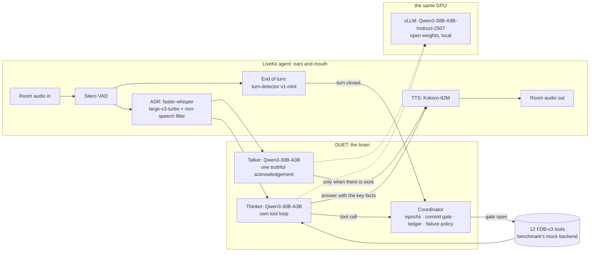

# DUET: an interruption-safe, dual-mind voice agent for Full-Duplex-Bench v3

**Samsung PRISM GenAI Hackathon 3.0 · Theme 05: Interruptible Real-Time Agents · Team SE7EN, SRM**

People interrupt, hesitate and correct themselves mid-sentence. Voice agents that
act on their behalf break exactly there. The Full-Duplex-Bench v3 paper
names the failure that costs every published system the most: *"models commit
intermediate parameters before the correction arrives."* Even the best system
(GPT-Realtime) fails over 40% of self-correction scenarios.

DUET is a custom LiveKit voice agent built around not doing that, without going
quiet while it waits:

- **Two minds.**
  - A **talker** (a fast model) acknowledges the user the moment there is work
    to cover, and never claims a result it doesn't have.
  - A **thinker** (a reasoning model with the tools) plans, calls tools and
    speaks the outcome.
  - Both run on one open-weights model, **Qwen3-30B-A3B-Instruct-2507**, on the
    same GPU as the speech models: no API key, nothing billed, one 48 GB GPU.
- **One coordinator** decides *when acting is allowed*:
  - No tool runs while the user is still speaking, or before the turn has
    closed and the user has been quiet for a short hold. The hold is longer
    while they are revising ("no wait…") or mid-sentence ("…and").
  - An identical action is never performed twice.
  - A failed read is retried once, and a failed or uncertain write is never
    blindly re-sent.

That maps onto the three capabilities the Theme 05 guide asks for:

| Guide | DUET |
|---|---|
| **Stay responsive**: no dead air, no false "done!" claims | The talker speaks while the thinker works. Nothing is announced as done before its tool result. A thinker failure still produces a spoken reply. |
| **Work asynchronously**: tools, perception and reasoning never block the conversation | Speech recognition, TTS and every tool run off the audio loop. Tools run while the acknowledgement plays, and a progress line covers slow tools. |
| **Recover cleanly**: discard stale intent, update tool arguments, never repeat a state-changing action | Epochs discard plans made on words the user has since changed. The commit gate keeps stale values from reaching a tool. The idempotency ledger gives exactly-once actions, including when the user barges in mid-call. |

## Results

> Filled in from the reported run's `results/live/<run>/summary.json`; the full
> run logs sit next to it (see [Run logs](#run-logs)).

| System (FDB-v3, 100 items) | Pass@1 | Tool F1 | Arg acc | Resp qual | Turn-take | Latency (task) | Interrupt |
|---|---|---|---|---|---|---|---|
| GPT-Realtime (paper) | 0.600 | 0.876 | 0.680 | 0.792 | 96.0% | 6.89 s | 13.5% |
| Gemini Live 3.1 (paper) | 0.540 | 0.817 | 0.588 | 0.718 | 78.0% | 4.25 s | 19.2% |
| Cascaded Whisper→GPT-4o→TTS (paper) | 0.450 | 0.803 | 0.562 | 0.600 | 100% | 10.12 s | 33.0% |
| **DUET (ours)** | *pending* | | | | | | |

**Listening alone, no model** (all 100 recordings through the official runner
and scripts, the agent answering "Okay." to every closed turn): every
conversation answered, 12% interruptions, and 4.09 s first-response latency as
the benchmark measures it, including its constant ~1.9 s recorder offset.
Record: [`results/reported/listening_dry_run`](results/reported/listening_dry_run).

## Architecture



Details, and why each piece exists: [docs/ARCHITECTURE.md](docs/ARCHITECTURE.md).

## Models and providers (declaration)

This is a **custom LiveKit agent**. It is not one of the benchmark's
realtime-provider presets.

| Role | Model | Where it runs |
|---|---|---|
| Thinker (reasoning, tool calls) | **Qwen3-30B-A3B-Instruct-2507** (Apache-2.0 open weights; `Qwen/Qwen3-30B-A3B-Instruct-2507-FP8` @ `5a5a776`, or `RedHatAI/Qwen3-30B-A3B-Instruct-2507-quantized.w4a16` @ `e9c59cd` on pre-Ada GPUs); temperature 0.7, top-p 0.8, top-k 20 (the model card's values), seed 7 | **Local GPU**, served by vLLM 0.19.1 |
| Talker (acknowledgements) | The same model, same server | Local GPU |
| Speech recognition | `faster-whisper` large-v3-turbo (`mobiuslabsgmbh/faster-whisper-large-v3-turbo` @ `0a363e9`, CTranslate2, float16) | Local GPU |
| Text-to-speech | Kokoro-82M (`hexgrad/Kokoro-82M` @ `f3ff357`, voice `af_heart`) | Local GPU |
| Voice activity | Silero VAD (LiveKit plugin) | Local CPU |
| End of turn | LiveKit `turn-detector-v1-mini` (audio model in `livekit-local-inference`) | Local CPU |
| Tool backend | The benchmark's own `mock_apis.py`, unmodified | Local |

**Why a local open-weights model.** Everything runs on the one GPU Samsung
provides:
- **No API key and nothing billed.** The re-run does not depend on a key's quota,
  tier, region or on a hosted model being withdrawn. In September 2026 two
  Gemini 2.5 models began refusing new keys.
- **It fits the 48 GB budget.** Qwen3-30B-A3B is a mixture-of-experts model: 30.5B
  parameters, of which about 3.3B are active per token, so it answers fast.
  - Its official FP8 build (31.2 GB) runs in a fixed 33 GiB budget.
  - That leaves room for the speech models (~3.5 GiB) and the benchmark's own
    scoring recognizer (~4-5 GiB).
  - Every run records its peak GPU memory in `summary.json`.
- **It runs on either GPU generation.** On GPUs older than Ada, whose kernels
  cannot run that FP8 build, the server loads Red Hat's 4-bit build (16.7 GB) in a
  22 GiB budget. The choice is automatic.

The Gemini API remains available as an alternative (`DUET_LLM_BACKEND=gemini`,
with `gemini-3.7-flash` and `gemini-3.5-flash-lite`). Every setting can be
overridden (`DUET_LLM_*`, `DUET_TEMPERATURE`, and the rest in
`duet_voice/config.py`), and each run records the effective values in
`run_config.json`.

## API keys: which ones, and where they go

**None is required.** The language model runs locally. Optional variables
(environment, or `.env.local` at the repository root, which is git-ignored; no
key is included in this repository):

| Variable | Needed for | Required? |
|---|---|---|
| `OPENAI_API_KEY` | The benchmark's gpt-4o judge (argument and response scoring, key-information latency). Without it our own reports use the local model as a labelled proxy judge | Optional |
| `LIVEKIT_URL`, `LIVEKIT_API_KEY`, `LIVEKIT_API_SECRET` | A LiveKit Cloud project. Without them, `reproduce.sh` downloads and runs a local LiveKit server (v1.13.7, checksum-verified) on free local ports | Optional |
| `GOOGLE_API_KEY` with `DUET_LLM_BACKEND=gemini` | Only for the Gemini alternative (a billing-enabled key: the free tier allows 20 requests per model per day) | Optional |

## Reproduce the benchmark: one command

```bash
bash scripts/doctor.sh           # optional: is this machine ready?
bash reproduce.sh                # all 100 items, then the three official evaluations
bash reproduce.sh --only travel_19_695bd157114f0d2317f88617   # a quick check first
```

- **Target machine:** Linux x86_64 with one NVIDIA GPU of 48 GB and a driver
  for CUDA 12.x or 13.x, plus `git`, `curl`, a C compiler (vLLM's Triton kernels
  build small helpers with it), internet access and about 90 GB of disk. No sudo
  and no system Python needed: a pinned `uv` supplies Python 3.11, and `ffmpeg`
  and the LiveKit server are fetched into `third_party/`. With several GPUs, the
  one with the most free memory is used (or set `CUDA_VISIBLE_DEVICES`).
- **Runtime:** about 2 hours. The benchmark streams every recording in real
  time, and each is about 47 s long. The first run also installs (about 15
  minutes) and downloads about 36 GB of models.
- **Step by step on a remote GPU machine:** [DGX_RUNBOOK.md](DGX_RUNBOOK.md).

What the script does, in order:
1. Creates three Python environments with uv (Python 3.11) and installs each
   from its lock file, so every package, direct and transitive, is at the version
   of our runs. `.venv` is the agent (`requirements.lock`). `.venv-bench` is the
   benchmark runner (`requirements-bench.lock`, with NVIDIA NeMo for the scoring
   recognizer). `.venv-llm` is the model server (`requirements-llm.lock`: vLLM
   0.19.1, the newest release on torch 2.10). All three use torch's CUDA 12.8
   build, which runs on CUDA 12.x and 13.x drivers.
2. Clones Full-Duplex-Bench and checks out the pinned commit `3e799c4`.
3. Downloads the benchmark audio from the Google Drive link in the v3 README and
   verifies its SHA-256 (retried; an existing copy can be used via `FDB_DATA_DIR`).
4. Uses your LiveKit Cloud project, or starts a local LiveKit server on free ports.
5. Pre-downloads every model (speech models, the language model's weights for
   this GPU, the scoring recognizer), so the timed run is not a download.
6. Runs `bench/run_live.py`:
   - starts the model server (`bench/llm_server.py`) and checks that it answers
     and that tool calling works;
   - starts the agent (`python -m duet_voice.agent start`);
   - runs the benchmark's **unmodified** `run_tool_benchmark_all_released.py
     --provider duet`;
   - runs its three evaluation scripts (`evaluate_tool_calls.py`,
     `evaluate_pass_rate.py`, `analyze_tool_latency.py`) with `--use-llm`;
   - prints the headline numbers, including the GPU's peak memory.

### Running the agent under your own harness

The agent is an ordinary LiveKit worker, so it also runs under a harness other
than ours. It joins every new room in the LiveKit project (no agent name, no
explicit dispatch), so run only this worker in that project.

```bash
export LIVEKIT_URL=... LIVEKIT_API_KEY=... LIVEKIT_API_SECRET=...
.venv/bin/python -m duet_voice.prefetch          # once: download and warm the speech models
.venv-llm/bin/python bench/llm_server.py serve & # the language model on 127.0.0.1:18000
.venv/bin/python -m duet_voice.agent start      # FDB_V3_DIR=... if the benchmark is elsewhere
```

The model server is ready when `python bench/llm_server.py health` says so, and
the worker when its log shows `registered worker` and `ready in`. Then
run the benchmark's own runner and evaluations with `--provider duet` (or any
name). Tool calls go to `/tmp/agent_tool_calls.log` in the benchmark's format.
The agent's tool backend is the benchmark's own `mock_apis.py`, found in
`third_party/Full-Duplex-Bench/v3` (where `reproduce.sh` clones it) or in `FDB_V3_DIR`.

## Run logs

Every run writes `results/live/<time>/` (git-ignored). The run we report is copied,
without audio, to the committed `results/reported/` folder with
`python bench/publish_run.py results/live/<time> --name <name>`:

| File | Content |
|---|---|
| `run_config.json` | The agent's effective settings (models, thinking level, temperature, seed, listening thresholds), any `DUET_*`/`FDB_*` overrides, the LiveKit target and the scoring ASR. |
| `summary.json` | Headline metrics, plus what the agent did (thinker errors, keep-listening decisions, talker lines, tool calls), the tokens used, and the GPU's peak memory. |
| `llm_server.log`, `llm_plan.json` | The model server's log, and which weights and memory budget it used on this GPU. |
| `duet_evaluation_report.json`, `duet_pass_rate_report.json`, `duet_latency_report.json` | The benchmark's own reports. |
| `items/*.json` | The benchmark's per-item results: transcripts, tool calls, timings. |
| `traces/*.jsonl` | Our per-conversation trace: every heard segment, turn decision, talker line, thinker step, tool call with arguments and outcome, token usage, and STT/TTS/end-of-turn timings. |
| `agent.log`, `runner.log`, `eval_*.log` | Process logs. |

## Develop

```bash
python -m duet_voice.agent console          # talk to the agent with your own mic
python bench/run_live.py --only travel_19   # one benchmark item, official scripts
python bench/run_live.py --dry-run          # no model, no key: checks listening and plumbing
python bench/offline_asr.py                 # what the agent's ears hear on all 100 inputs
python bench/offline_eval.py --start-server --judge   # the thinker alone on those transcripts, officially scored
bash scripts/offline_eval.sh                # the same, on a machine set up by reproduce.sh
python bench/llm_server.py plan             # which weights and memory budget this GPU gets
python bench/cost_report.py results/live/<run>   # tokens (and dollars, for the Gemini API), from the traces
python -m pytest tests -q
python tests/fake_openai.py &               # a scripted stand-in for the model server (no GPU):
DUET_LLM_BASE_URL=http://127.0.0.1:8766/v1 python bench/run_live.py --only travel_19
                                            #   exercises the model-driven path end to end
```

## Integrity and reproducibility

- **No benchmark item is written into the agent.** Prompts and tool schemas are
  written from general principles. `tests/test_voice_integrity.py` fails if any
  argument value the benchmark expects appears in any string the agent contains.
- **Nothing is cached across scenarios.** Each LiveKit room gets a fresh
  coordinator, toolbox and conversation state. Only model weights are shared.
- **No calls to our own servers.** The language model runs on the evaluation
  machine itself (listening on 127.0.0.1 only). The only remote service is
  LiveKit, and only when a LiveKit Cloud project is used.
- **Pinned:**
  - every Python package, including transitive ones (`requirements*.lock`);
  - the benchmark commit, the data checksum and the LiveKit server version;
  - the exact Hugging Face revisions of the speech models and of the language
    model's weights;
  - a fixed seed on every model call, and greedy speech recognition.
- **Robust on someone else's machine.**
  - The language model gets the same fixed memory budget on any GPU.
  - The local LiveKit server takes free ports and never reuses another user's.
  - The model server listens on its own port (18000).
  - Downloads and caches stay inside the repository folder.
- **Tool schemas.** Names, argument names and the call log format are the
  benchmark's. Arguments that a real API would treat as optional (for example an
  apartment budget) are optional here, rather than forcing the model to invent a
  value. Where the mock backend's Python signature needs such a value anyway, the
  adapter passes a neutral default, and the logged call keeps exactly what the
  agent asked for. See `duet_voice/fdb_tools.py`.

## Use-case extension

*In progress: this section will mark the extension, its code and how to run it.*
Research behind the choice: [docs/USE_CASE_RESEARCH.md](docs/USE_CASE_RESEARCH.md).

## Repository map

```
duet_voice/        the agent: LiveKit entrypoint, talker, thinker (local model or Gemini), coordinator, tools, speech models
bench/             benchmark drivers: live runner, model server launcher, offline evaluators, judge adapter
scripts/           machine check, fast offline evaluation, packing results (for remote GPU machines)
DGX_RUNBOOK.md     step-by-step instructions for running everything on a remote GPU machine
tests/             coordinator, speaking-flow and integrity tests
docs/              architecture, use-case research
reproduce.sh       one-command reproduction
legacy/kit_v1/     the previous Theme 05 kit and DUET v1 (research record, not used)
```

## References

- G.-T. Lin, C. Chen, Z. Chen, H.-y. Lee. *Full-Duplex-Bench-v3: Benchmarking Tool Use
  for Full-Duplex Voice Agents Under Real-World Disfluency.* arXiv:2604.04847, 2026.
  Code and data: <https://github.com/DanielLin94144/Full-Duplex-Bench> (v3).
- LiveKit Agents: <https://github.com/livekit/agents> · faster-whisper:
  <https://github.com/SYSTRAN/faster-whisper> · Kokoro-82M:
  <https://huggingface.co/hexgrad/Kokoro-82M> · Silero VAD:
  <https://github.com/snakers4/silero-vad> · Gemini API: <https://ai.google.dev>.
