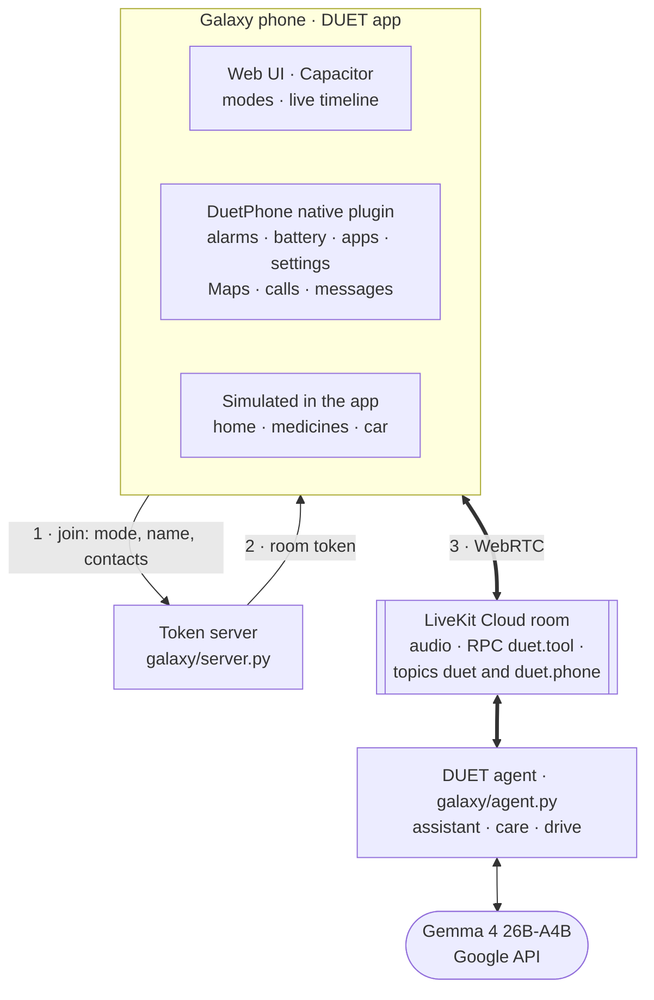

# DUET for Galaxy: the use-case extension

DUET is a full-duplex voice agent: you can interrupt it, correct yourself mid-sentence and
change your mind, and it never acts on words you took back. The benchmark submission shows
this on Full-Duplex-Bench v3. This app puts the same agent, the same coordinator and the
same Gemma 4 model on a Samsung Galaxy phone.

| Mode | For whom | What it shows |
|---|---|---|
| **Assistant** | Every Galaxy owner | An alarm corrected mid-sentence; battery troubleshooting from the phone's real readings that you can interrupt; installed apps, brightness and settings, Google Maps, the smart home |
| **Care** | An older person living alone, and their family | Medicines with a double-dose guard, calls and messages to family, reminders, a daily check-in, a family alert |
| **Drive** | A driver, eyes on the road | A destination changed mid-sentence, arrival-time messages, the car's climate, the home from the car |

## How it works



- **The agent** is the benchmark's agent with each mode's tools and instructions
  (`duet_voice/galaxy/modes.py`): the same ears (Silero VAD, Whisper large-v3-turbo, the
  end-of-turn model), the same mouth (Kokoro), the same fast voice, thinker and coordinator.
- **Every action passes the coordinator:**
  - nothing runs while you are speaking;
  - nothing runs before you have been quiet for the commit hold;
  - a plan your later words overtook is never carried out;
  - no action runs twice.
- **The app shows each step live** on its timeline: what DUET heard, what it planned,
  **Never ran** (a plan your correction overtook), **Done**, **Not repeated**, and what it
  said.
- **Context the phone needs:** the thinker knows the time; if you cut an answer short, it
  knows how much of it you heard; a plan that never ran is reported as never carried out,
  so DUET never claims it.

**What is real and what is simulated:**
- **Real, through Android's public interfaces:** alarms and timers in the Clock app;
  battery, temperature, current drain, brightness, refresh rate, screen timeout, Wi-Fi,
  Bluetooth and location; screen time per app and the installed apps; brightness and
  timeout changes; settings screens, opening apps, Google Maps navigation; calls and texts.
- **Simulated inside the app:** the SmartThings-style home, the medicine schedule and the
  car's trip.

## Run it

**1. The laptop or server.** Needs `.env.livekit` with your LiveKit Cloud project's URL, key
and secret, and a Google API key in `.env.local` (`GOOGLE_API_KEY` or `GOOGLE_API_KEYS`), as
for the benchmark.

```bash
bash scripts/galaxy_demo.sh
```

It checks the Google key, starts the agent (connected to LiveKit Cloud) and the token
server with the web app on port 8787, and prints the machine's address for the phone, for
example `192.168.1.20:8787`. On Windows, allow Python to accept connections on private
networks the first time, or the phone cannot reach it.

**2. The phone.**
1. Install the APK (`app/android/app/build/outputs/apk/debug/app-debug.apk`): copy it over
   and open it, allowing "install unknown apps" once, or use `adb install -r app-debug.apk`.
2. Put the phone on the same Wi-Fi, or pair in one step: open `localhost:8787/pair.html` on
   the laptop and scan its code from the app.
3. Open DUET, then Settings:
   - enter the server address, your name and the contacts DUET may call;
   - under Phone access, allow **Screen time per app** and **Change brightness and timeout**.
4. Choose a mode and allow the microphone. Galaxy Buds give the cleanest audio: no echo and
   no false interruptions.

**In a browser instead:** open `http://localhost:8787` on the laptop. Phone actions are then
simulated.

## Try these

| Mode | Say | What to watch |
|---|---|---|
| Assistant | "Set an alarm for 3:30." Pause. "No no, cancel that, set it for 4:30." | Timeline: 3:30 **Never ran**, 4:30 **Done**; one alarm in Clock |
| Assistant | "Set an alarm for 3:30", wait for DUET, then "No, make it 4:30" | DUET had set 3:30, so it cancels it and sets 4:30 |
| Assistant | "Wake me at 6:30, or maybe 7, hmm." | DUET asks "6:30 or 7?" instead of guessing |
| Assistant | "My battery drains super fast. What's going on?" Then, while it explains: "Oh wait, I think it's my brightness and games." | Real readings; DUET stops, checks your theory against the numbers, and offers a fix without making it |
| Assistant | "How many shopping apps do I have?" | Counted from the phone's real app list |
| Care | "Did I take my blood pressure tablet? I'll just take it now." | The double-dose guard: it was taken this morning, so not again |
| Care | Tap "Simulate: evening medicine time" | DUET speaks first with the reminder |
| Drive | "Take me to the office. No wait, the airport." | Only the airport is set |
| Drive | Tap "Simulate: 10 min from destination" | DUET offers one useful thing, such as cooling the house |

## Test without a phone

`scripts/galaxy_fake_phone.py` joins a room like the app does. It speaks scripted lines,
answers DUET's tool calls with a simulated phone, and saves every timeline event to
`results/galaxy/scenario_*.json`:

```bash
python scripts/galaxy_fake_phone.py --list
python scripts/galaxy_fake_phone.py alarm_late
```

## Build the APK

JDK 21, Android SDK 36 and Node 20+:

```bash
cd app
npm install
npm run sync
cd android
./gradlew assembleDebug
```

## Record the demo video

The film `results/galaxy/video/DUET_for_Galaxy_demo.mp4` is made from live runs of the real
stack: Gemma 4, the agent and LiveKit Cloud. Only the user is scripted:
- the lines in `app/www/demo/scenes.json` are spoken by Kokoro voices (`app/www/demo/audio/`);
- `demo-driver.js` plays each line into the room instead of a microphone. It waits for
  DUET's reply, or cuts in while DUET is talking, as a person would;
- `demo.html` is the 1920×1080 stage: the app in a phone frame, DUET's steps live, and
  captions.

```bash
python scripts/galaxy_demo_voices.py                  # once: the scripted user's lines
bash scripts/galaxy_demo.sh                           # the agent and token server (see above)
cd app && npm install
TAKE=1 node tools/record_demo.js all                  # one take of every scene: <scene>_t1.mp4
cp ../results/galaxy/video/correction_t1.mp4 ../results/galaxy/video/correction.mp4   # the take to keep, per scene
node tools/build_film.js                              # cards + scenes -> DUET_for_Galaxy_demo.mp4
```

Each take is a new live conversation, so takes differ: record two or three and keep the
best of each scene. Every take's full log is in `results/galaxy/traces/<room>.jsonl`; the
room name is printed when the take is recorded.
