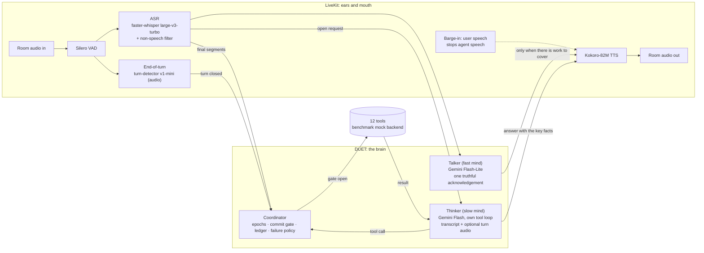

# DUET architecture

DUET is a voice agent built for one hard problem: **acting on what a person
means, while they are still changing their mind**. The Full-Duplex-Bench v3
paper names the failure that costs every published system the most: "models
commit intermediate parameters before the correction arrives". DUET is organised
around not doing that, without going quiet while it waits.

## The two minds

**Talker.** A fast model (no tools, no thinking) turns the user's words into
one short sentence that shows they were understood ("Sure, checking those
flights now"). It names the task but never a value, because the user may still
be correcting it. It never states a result, because it has none.

**Thinker.** Gemini with the twelve tools, run by DUET's own loop rather than
the framework's: every call goes through the coordinator. It keeps its own
native conversation state (function calls, results and Gemini's thought
signatures) and, optionally, hears the turn's audio as well as the transcript,
so a mis-heard word or a spelled id can be recovered from the sound.

Both start together when a turn ends, or earlier: LiveKit runs generation
*preemptively* during a pause, so the plan is often ready by the time the turn
closes. DUET raises LiveKit's limits (10 s into a turn, 3 attempts) to 120 s and
20 attempts, because FDB-v3's requests are long and full of pauses. Planning
early is safe because acting early is not allowed.

**Model availability.** Each role (thinker, talker) has a list of current
Gemini models. At start-up the worker makes one tiny request per role. If the
API refuses the declared model (as it began doing for some Gemini 2.5 models in
September 2026), the next one in the list is used and the choice is logged.

## When the agent speaks, and when it keeps listening

The end-of-turn detector closes a turn after about 0.8 s of silence. That is
often too early: in our no-model run it closed turns after "Like, you know." and
after "Could you track it for me?", with the order id still to come. So the
thinker's first look at a turn decides whether the user has finished:

| The thinker decides | What the user hears |
|---|---|
| **The user is not finished** (cut off mid-sentence, or announced a detail not yet given): it calls `keep_listening` | Nothing. Nothing is done or remembered. Once the user has been quiet for 2.5 s, the thinker looks again with `keep_listening` removed. It acts, or asks for exactly what is missing. If the user resumes first, the next turn re-reads everything. |
| **Tools are needed** | The talker's acknowledgement at once, then the thinker's answer after the tool results. If the talker has nothing within 0.6 s (a slow or failed API call), "One moment." instead: no dead air, and no claim. "Still working on it." every 3.5 s while a slow tool runs. |
| **No tool is needed** (a greeting, a question, a clarification) | Only the thinker's answer. |
| **Noise, not speech** (`<silent>`) | Nothing. |
| **Not decided yet after 0.9 s** | The acknowledgement, but only once the user has been quiet for 1.6 s, never in a pause they may resume. |
| **The thinker fails** (after retries) | "Sorry, something went wrong on my side. Could you say that once more?" The user is never left in silence. |

Model calls retry rate limits and server errors (up to three times, with
backoff), and the thinker asks once more after an empty or malformed reply.
A request counts as answered only once a reply is actually spoken. A reply
drafted during a pause and then discarded leaves the request open.

## The coordinator: when the agent may act

| Mechanism | What it guarantees | Where |
|---|---|---|
| **Epochs** | The epoch advances every time the user starts speaking, and when words arrive after a turn was closed (the end of a segment still being transcribed when the end-of-turn detector fired). Every tool call carries the epoch its plan was made in; a plan the user's words have overtaken is refused at the gate, even after the newer turn has closed. | `coordinator.py` |
| **Commit gate** | A tool runs only once the end-of-turn detector has closed the turn *and* the user has been quiet for a hold: 1.1 s normally, 1.8 s while they have been revising ("no wait", "actually", "instead"), 2.2 s when the last words leave a sentence open ("and", "um", "let me think"). A call that meets new speech at the gate is superseded: never executed, never logged. | `coordinator.py` |
| **Idempotency ledger** | An identical call already made in this conversation is answered from the ledger (case, order and spacing ignored). A state-changing action is never performed twice. | `coordinator.py` |
| **Failure policy** | A read-only call that fails is retried once. A state-changing call is never re-sent: if its outcome is unknown (timeout), the ledger remembers that and the user is told, with an offer of a human agent. | `coordinator.py` |
| **Open request** | Everything the user said since the last reply that was actually spoken is re-read as one request, so a correction that arrives as a separate turn is read together with what it corrects. | `agent.py` |

## Perception

- **VAD**: Silero, 0.35 s minimum silence per segment.
- **ASR**: faster-whisper large-v3-turbo on the GPU, one VAD segment at a time,
  with a prompt listing the agent's own tool vocabulary. Segments the model
  itself rates as non-speech (high no-speech probability with low
  log-probability, or a degenerate compression ratio) are dropped. In FDB-v3
  every request is followed by about 30 s of the speaker's real room noise, and
  that is exactly where Whisper invents sentences; an invented sentence could
  trigger an extra, failing tool call.
- **End of turn**: LiveKit's `turn-detector-v1-mini`, an audio model that runs
  locally, with a 0.8 s minimum and 2.5 s maximum endpointing delay.

## Tools

The twelve FDB-v3 tools keep the benchmark's names, argument names and log
format (`/tmp/agent_tool_calls.log`), and call the benchmark's own mock backend.
Three deliberate differences from the reference agents, each true of any real
voice agent:

1. **Optional arguments are optional.** A real apartment search does not need a
   budget. The reference schema makes one required, forcing a model to invent
   a number the user never said.
2. **Calls go through the coordinator**, and the backend runs in a worker
   thread, so an injected API delay never freezes the audio loop (the
   reference agents call it synchronously inside the event loop).
3. **The log records what the agent asked for.** Where the mock's Python
   signature needs a value the schema leaves optional, the adapter fills a
   neutral backend default; the logged call keeps the agent's arguments.

## Resource use

Everything local fits in about 4 GB of GPU memory (Whisper turbo in float16, and
Kokoro); the 48 GB evaluation GPU is far more than needed. The thinker and
talker run on the Gemini API. They are Gemini-only today; serving an open-weight
model on the same GPU would mean a second backend for the thinker's tool loop.
