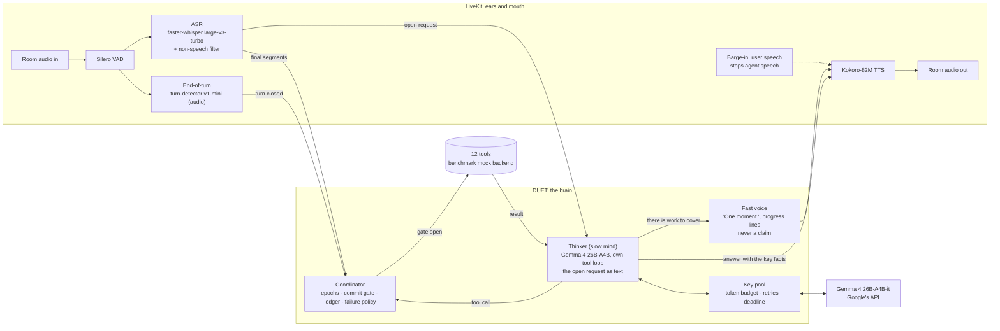

# DUET architecture

DUET is a voice agent built for one hard problem: **acting on what a person
means, while they are still changing their mind**. The Full-Duplex-Bench v3
paper names the failure that costs every published system the most: "models
commit intermediate parameters before the correction arrives". DUET is organised
around not doing that, without going quiet while it waits.

## The two minds

**Thinker.** Gemma 4 26B-A4B-it (Google's open-weights model, Apache 2.0) with the
twelve tools, run by DUET's own loop rather than the framework's: every call goes
through the coordinator. It keeps the model's native conversation state (tool calls,
results, thoughts and their signatures, not just text). Gemma 4 thinks before it
answers; the API takes no setting for it.

**Fast voice.** Once the user has clearly finished (1.6 s of quiet, which by the
benchmark's own rule is past the end of the turn) and the thinker has not answered
yet, or the moment it decides there is work to do, the user hears "One moment.",
then "Still working on it." every 6 s while tools run. It never names a value (the
user may still be correcting it) and never states a result. With a local model the
fast voice is itself a model (a short acknowledgement naming the task, as in the
phone app); with a hosted model a call takes seconds, too slow for a line that must
come at once, so it is a fixed line.

**The model, through Google's API** (`duet_voice/gemma_api.py`). Google serves Gemma
free of charge on free-tier projects, with 16,000 input tokens per minute per model
per project. One thinker call is about 2,300 input tokens. Each benchmark recording
gives the agent about 30 seconds after the request before the room closes, so a call
must never wait out a rate limit or die on a transient error:

| Mechanism | What it does |
|---|---|
| **Key pool** | `GOOGLE_API_KEYS=key1,key2,...`; keys from different projects add up their limits. Each call goes to the key with the most room for that model. |
| **Token budget** | 15,000 input tokens per key, model and minute (`DUET_GEMMA_TPM`). A call is booked before it is sent and waits for room rather than being refused; the booking is corrected to the real count afterwards. |
| **Refusals** | A 429 rests that key for the delay Google asks for, and the call moves to another key at once. |
| **Transient errors** | 500, 503, 504 and timeouts (frequent on the free tier) are retried within 0.3-0.7 s, inside one deadline per call (28 s): past it the recording's window is gone. A bad key, a model the key cannot use, or a malformed request fails at once. |
| **Backup requests** | A request with no answer after 6 s (answers take 3 s at the median, 7 s at the 95th percentile) gets a backup on the key with the most room; the first answer wins and the others are cancelled. At most four are in flight. In one night's run 26 of about 350 requests hung for good; before backups, two hangs in a row lost the whole recording. |
| **Fallback model** | If Google stops serving `gemma-4-26b-a4b-it` to a key, `gemma-4-31b-it` is used (slower, its own quota). |

**No wasted calls.** Every call counts against the per-minute budget, including one
the agent later throws away:
- LiveKit can plan *preemptively* during a user's pause; with a hosted model that is
  switched off, since most early plans are discarded when the user goes on.
- The end-of-turn detector can close a turn while the user's last words are still
  being transcribed (on the laptop GPU, a third of all turns). Their transcript
  would void any plan made without them, so the thinker first waits for it (at most
  1.5 s after the speech ended; a noise burst has no words). A turn whose words are
  all in waits for nothing.

**Before any run.** The runner checks, in seconds, that every key can use Gemma 4
and that a test request with a correction ("K 7, no wait, K 4 Q 2") returns the right
tool call. A key that cannot use Gemma, a wrong key or no network stops the run there,
with the fix, instead of producing 100 failures. Then one throwaway conversation
(`bench/warmup.py`) pays the agent's one-time start-up costs: the first room a process
joins starts WebRTC, which took 16 s on a fresh WSL2 machine, and the benchmark's
runner starts streaming 2 s after it joins, without waiting for the agent.

## When the agent speaks, and when it keeps listening

The end-of-turn detector closes a turn after about 0.8 s of silence. That is
often too early: in our no-model run it closed turns after "Like, you know." and
after "Could you track it for me?", with the order id still to come. So the
thinker's first look at a turn decides whether the user has finished:

| The thinker decides | What the user hears |
|---|---|
| **The user is not finished** (cut off mid-sentence, or announced a detail not yet given): it calls `keep_listening` | Nothing. Nothing is done or remembered. Once the user has been quiet for 2.5 s, the thinker looks again with `keep_listening` removed. It acts, or asks for exactly what is missing. If the user resumes first, the next turn re-reads everything. |
| **Tools are needed** | "One moment." at once (if not already said), then the thinker's answer after the tool results: no dead air, and no claim. "Still working on it." every 6 s while it works. |
| **Still deciding** after the user has clearly finished | "One moment.", then whatever the thinker decides. |
| **No tool is needed** (a greeting, a question, a clarification) | Only the thinker's answer. |
| **Noise, not speech** (`<silent>`) | Nothing. |
| **The thinker fails** (after retries) | "Sorry, something went wrong on my side. Could you say that once more?" The user is never left in silence. |

Model calls survive rate limits and server errors (the key pool above), and the
thinker asks once more after an empty or malformed reply.
A request counts as answered only once a reply is actually spoken. A reply
drafted during a pause and then discarded leaves the request open.

## The coordinator: when the agent may act

| Mechanism | What it guarantees | Where |
|---|---|---|
| **Epochs** | The epoch advances every time the user starts speaking, and when words arrive after a turn was closed (the end of a segment still being transcribed when the end-of-turn detector fired). Every tool call carries the epoch its plan was made in; a plan the user's words have overtaken is refused at the gate, even after the newer turn has closed. | `coordinator.py` |
| **Commit gate** | A tool runs only once the end-of-turn detector has closed the turn *and* the user has been quiet for a hold: 1.1 s normally, 1.8 s while they have been revising ("no wait", "actually", "instead"), 2.2 s when the last words leave a sentence open ("and", "um", "let me think"). A call that meets new speech at the gate is superseded: never executed, never logged. | `coordinator.py` |
| **Idempotency ledger** | An identical call already made in this conversation is answered from the ledger (case, order and spacing ignored). A state-changing action is never performed twice. | `coordinator.py` |
| **Failure policy** | A read-only call that fails is retried once. A state-changing call is never re-sent: if its outcome is unknown (timeout), the ledger remembers that and the user is told, with an offer of a human agent. | `coordinator.py` |
| **Open request** | Everything the user said since the last reply that was actually spoken is re-read as one request, so a correction that arrives as a separate turn is read together with what it corrects. | `agent.py` |

## Perception

- **VAD**: Silero, 0.35 s minimum silence per segment.
- **ASR**: faster-whisper large-v3-turbo on the GPU, one VAD segment at a time,
  with a prompt listing the agent's own tool vocabulary. Segments the model
  itself rates as non-speech (high no-speech probability with low
  log-probability, or a degenerate compression ratio) are dropped. In FDB-v3
  every request is followed by about 30 s of the speaker's real room noise, and
  that is exactly where Whisper invents sentences; an invented sentence could
  trigger an extra, failing tool call.
- **End of turn**: LiveKit's `turn-detector-v1-mini`, an audio model that runs
  locally, with a 0.8 s minimum and 2.5 s maximum endpointing delay.

## Tools

The twelve FDB-v3 tools keep the benchmark's names, argument names and log
format (`/tmp/agent_tool_calls.log`), and call the benchmark's own mock backend.
Three deliberate differences from the reference agents, each true of any real
voice agent:

1. **Optional arguments are optional.** A real apartment search does not need a
   budget. The reference schema makes one required, forcing a model to invent
   a number the user never said.
2. **Calls go through the coordinator**, and the backend runs in a worker
   thread, so an injected API delay never freezes the audio loop (the
   reference agents call it synchronously inside the event loop).
3. **The log records what the agent asked for.** Where the mock's Python
   signature needs a value the schema leaves optional, the adapter fills a
   neutral backend default; the logged call keeps the agent's arguments.

Arguments are cleaned the way a real API would take them (`coerce` in
`fdb_tools.py`): a filter value is a number, a yes/no or text (the reference schema
makes it a string: "1800", "true"); a date is month and day ("August 20", not
"20th"); an id the user spelled out is joined ("Q-4" is "Q4"), as the schemas ask.

## Resource use

The GPU runs speech only; the language model runs at Google.

| Process | GPU memory |
|---|---|
| Agent (Whisper large-v3-turbo in float16, Kokoro, CUDA context) | ~3.5 GiB |
| The benchmark's scoring recognizer (Parakeet, in the runner) | ~4-5 GiB |
| **Total** | **about 8 GiB**, far inside Samsung's 48 GB card |

`summary.json` records the peak GPU memory of the run's own processes.
