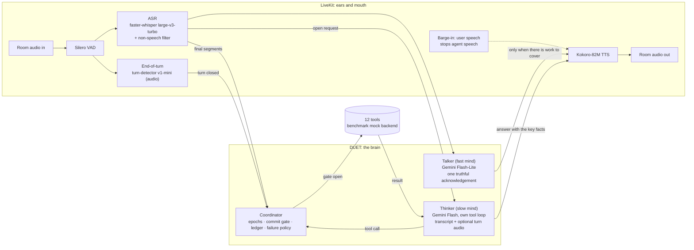

# DUET architecture

DUET is a voice agent built for one hard problem: **acting on what a person
means, while they are still changing their mind**. The Full-Duplex-Bench v3
paper names the failure that costs every published system the most: "models
commit intermediate parameters before the correction arrives". DUET is organised
around not doing that, without going quiet while it waits.

## The two minds

**Talker.** A fast model (no tools, no thinking) turns the user's words into
one short sentence that shows they were understood ("Sure, checking flights to
Oslo for Friday"). It speaks only when there is work to cover: if the thinker
decides within 0.9 s that no tool is needed (a greeting, a question), the
thinker's own answer is the only speech. It never states a result, because it
has none.

**Thinker.** Gemini with the twelve tools, run by DUET's own loop rather than
the framework's: every call goes through the coordinator. It keeps its own
native conversation state (function calls, results and Gemini's thought
signatures) and, optionally, hears the turn's audio as well as the transcript,
so a mis-heard word or a spelled id can be recovered from the sound.

Both start together when a turn ends, or earlier: LiveKit runs generation
*preemptively* during a pause, so the plan is often ready by the time the turn
closes. Planning early is safe because acting early is not allowed.

## The coordinator: when the agent may act

| Mechanism | What it guarantees | Where |
|---|---|---|
| **Epochs** | Every time the user starts speaking the epoch advances. Work planned under an older epoch was planned on words that may be changing, and is discarded. | `coordinator.py` |
| **Commit gate** | A tool runs only once the end-of-turn detector has closed the turn *and* the user has been quiet for a hold: 1.1 s normally, 1.8 s while they have been revising ("no wait", "actually", "instead"), 2.2 s when the last words leave a sentence open ("and", "um", "let me think"). A call that meets new speech at the gate is superseded: never executed, never logged. | `coordinator.py` |
| **Idempotency ledger** | An identical call already made in this conversation is answered from the ledger (case, order and spacing ignored). A state-changing action is never performed twice. | `coordinator.py` |
| **Failure policy** | A read-only call that fails is retried once. A state-changing call is never re-sent: if its outcome is unknown (timeout), the ledger remembers that and the user is told, with an offer of a human agent. | `coordinator.py` |
| **Open request** | Everything the user said since the thinker last finished is re-read as one request, so a correction that arrives as a separate turn is read together with what it corrects. | `agent.py` |

## Perception

- **VAD**: Silero, 0.35 s minimum silence per segment.
- **ASR**: faster-whisper large-v3-turbo on the GPU, one VAD segment at a time,
  with a prompt listing the agent's own tool vocabulary. Segments the model
  itself rates as non-speech (high no-speech probability with low
  log-probability, or a degenerate compression ratio) are dropped. In FDB-v3
  every request is followed by about 30 s of the speaker's real room noise, and
  that is exactly where Whisper invents sentences; an invented sentence could
  trigger an extra, failing tool call.
- **End of turn**: LiveKit's `turn-detector-v1-mini`, an audio model that runs
  locally, with a 0.8 s minimum and 2.5 s maximum endpointing delay.

## Tools

The twelve FDB-v3 tools keep the benchmark's names, argument names and log
format (`/tmp/agent_tool_calls.log`), and call the benchmark's own mock backend.
Three deliberate differences from the reference agents, each true of any real
voice agent:

1. **Optional arguments are optional.** A real apartment search does not need a
   budget. The reference schema makes one required, forcing a model to invent
   a number the user never said.
2. **Calls go through the coordinator**, and the backend runs in a worker
   thread, so an injected API delay never freezes the audio loop (the
   reference agents call it synchronously inside the event loop).
3. **The log records what the agent asked for.** Where the mock's Python
   signature needs a value the schema leaves optional, the adapter fills a
   neutral backend default; the logged call keeps the agent's arguments.

## Resource use

Everything local fits in about 4 GB of GPU memory (Whisper turbo in float16, and
Kokoro); the 48 GB evaluation GPU is far more than needed. The thinker and
talker run on the Gemini API; an OpenAI-compatible endpoint (for example a local
vLLM) can replace them (`DUET_THINKER_PROVIDER=openai`, `DUET_THINKER_BASE_URL`).
