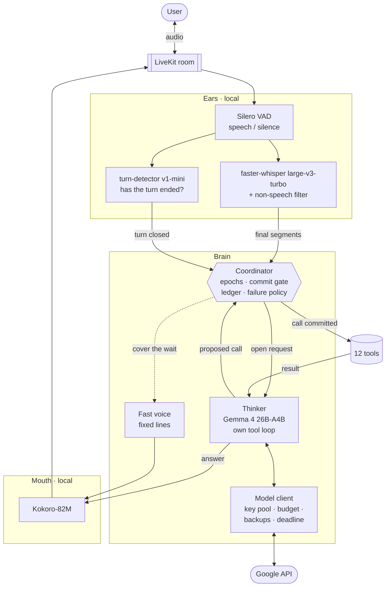
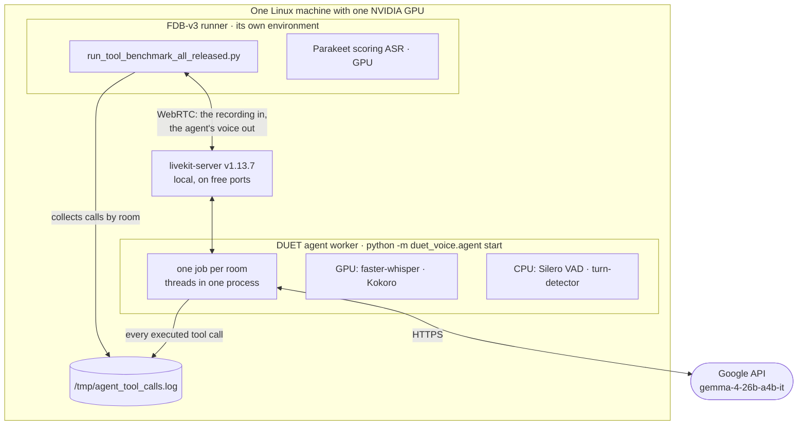
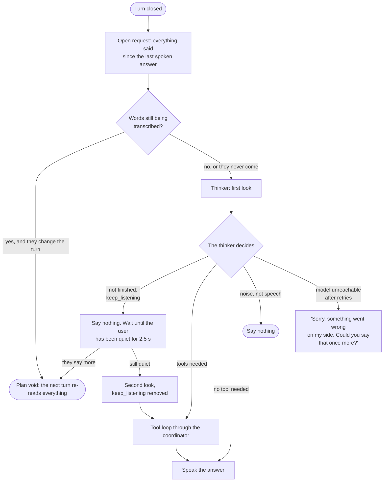
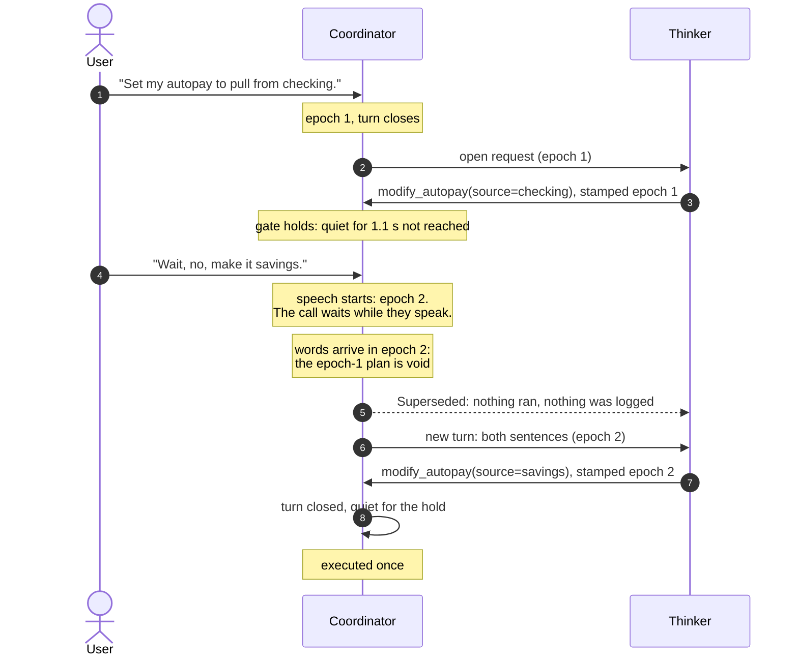
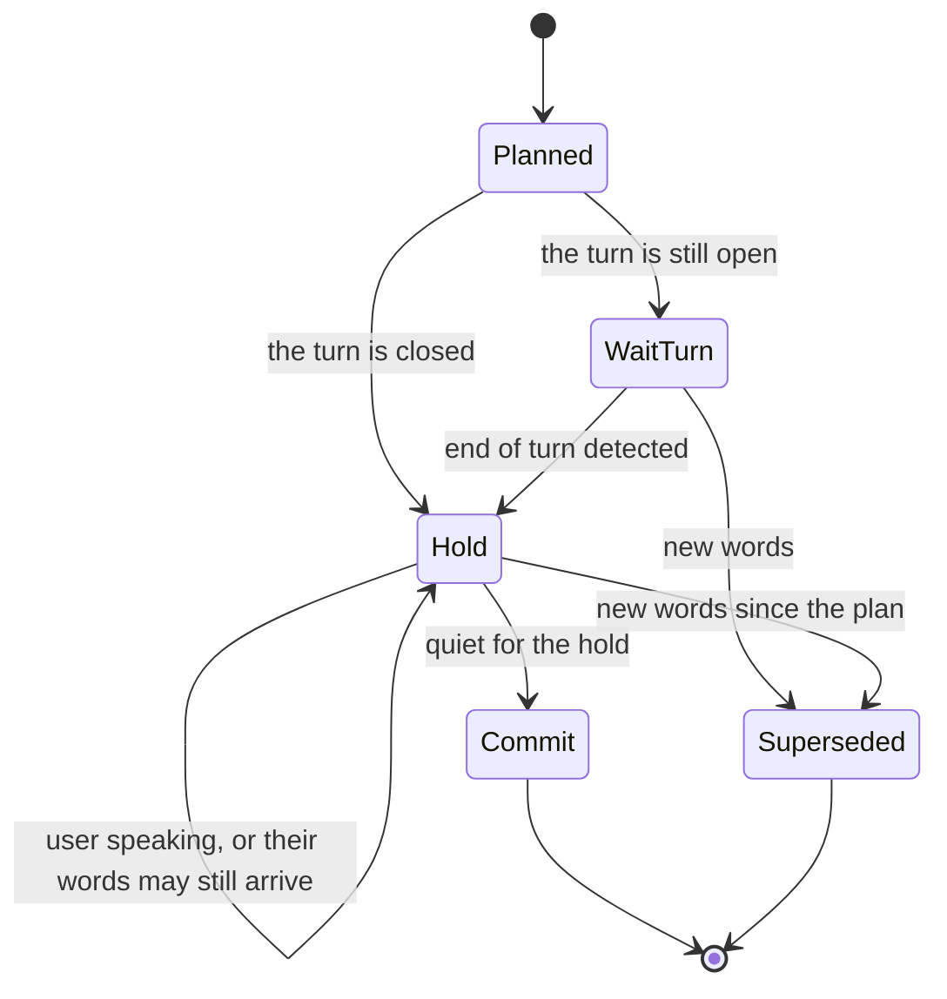
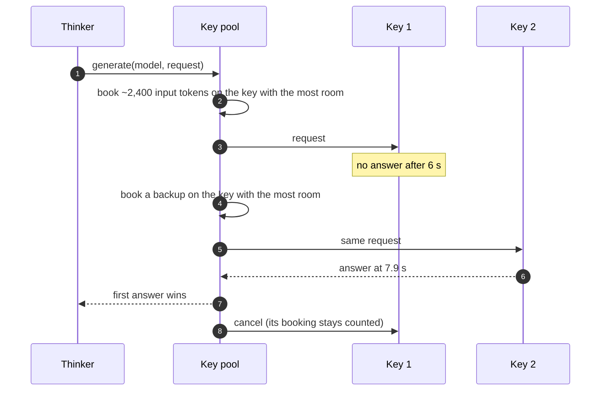
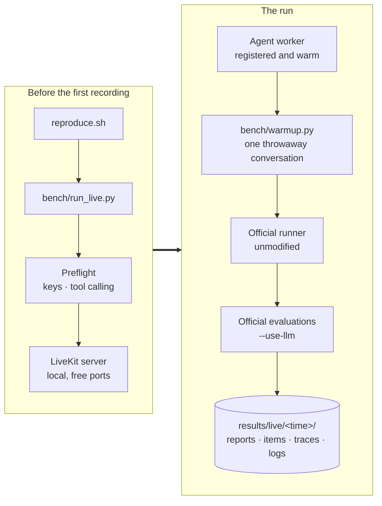
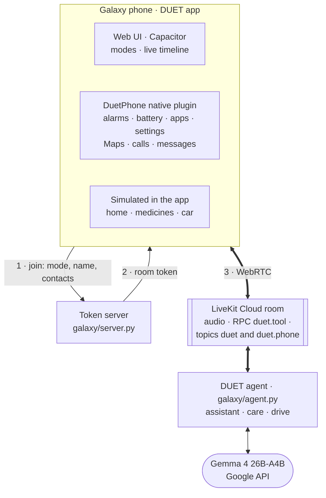

# DUET architecture

DUET is a voice agent built for one hard problem: **acting on what a person means
while they are still changing their mind**. The Full-Duplex-Bench v3 paper names the
failure that costs every published system the most: *"models commit intermediate
parameters before the correction arrives."* DUET is organised around never doing that,
without leaving the user in silence.

This document describes every part of the system, why it exists, and the thresholds it
uses. The README gives the short version.

- [1. The system at a glance](#1-the-system-at-a-glance)
- [2. Where everything runs](#2-where-everything-runs)
- [3. The ears](#3-the-ears)
- [4. The turn loop](#4-the-turn-loop)
- [5. The coordinator](#5-the-coordinator)
- [6. The thinker](#6-the-thinker)
- [7. The model client](#7-the-model-client)
- [8. The tools](#8-the-tools)
- [9. The benchmark harness](#9-the-benchmark-harness)
- [10. DUET for Galaxy](#10-duet-for-galaxy)
- [11. Latency and resources](#11-latency-and-resources)
- [12. Configuration](#12-configuration)

## 1. The system at a glance

Three ideas carry the design:

1. **Two minds.** A thinker that is allowed to be slow and careful, and a fast voice that
   never lets the conversation go silent. The fast voice says only things that stay true
   whatever the user says next.
2. **One owner for every action.** The model proposes tool calls; the coordinator decides
   whether and when each one runs. The model can be wrong about timing without the user
   ever paying for it.
3. **The whole request, every time.** The thinker always reads everything the user has
   said since the last answer that was actually spoken, so a correction is never read
   without the words it corrects.

## 2. Where everything runs

- Conversations run as **threads of one worker process**, so the speech models are loaded
  once and shared, however many rooms come and go. Model calls release the GIL and never
  block the audio loop.
- The worker reports its **load in conversations, not CPU**: between recordings the
  benchmark's own scoring recognizer loads the CPU, and LiveKit's default CPU-based load
  would make the worker refuse rooms.
- The only remote service is **Google's API** for the language model (and LiveKit Cloud,
  if a project is configured instead of the local server).

## 3. The ears

| Stage | Component | Setting | Why |
|---|---|---|---|
| Voice activity | Silero VAD | 0.35 s minimum silence per segment | Short enough to see a pause, long enough to ignore a breath |
| Recognition | faster-whisper large-v3-turbo, float16 on the GPU, one VAD segment at a time, greedy/beam decoding | A prompt listing the tools' vocabulary | Deterministic re-runs; ids, currencies and document names are heard more often |
| Non-speech filter | Whisper's own confidences | Drop a segment with no-speech probability > 0.6 and mean log-probability < -1.0, or a degenerate compression ratio | Every FDB-v3 request is followed by ~30 s of the speaker's real room noise, exactly where Whisper invents sentences, and an invented sentence can trigger an extra, failing call |
| End of turn | LiveKit `turn-detector-v1-mini`, an audio model, locally | 0.8 s minimum, 2.5 s maximum endpointing delay | Closes a turn quickly when the user has clearly finished |

The ears only report what they heard and when a turn seems to have ended. Whether the user
has *really* finished is decided later, by the thinker (section 6), and whether an action
may run is decided by the coordinator (section 5).

**Late transcripts.** The end-of-turn model judges the audio, and it can close a turn while
Whisper is still transcribing the last segment (in our laptop runs, about a third of all
turns). The words that arrive afterwards are the end of the user's sentence, often a
correction: *"...pay it from checking. Wait, no, make it savings."* Two rules make this
harmless:

- words that arrive after a turn closed advance the epoch, exactly like new speech, so any
  plan made without them is void (section 5);
- before the thinker spends a model call on a closed turn, it waits for a transcript that is
  still due, at most 1.5 s after the speech ended (`Coordinator.settle`). A turn whose words
  are all in waits for nothing.

## 4. The turn loop

Every closed turn runs DUET's `llm_node` (`duet_voice/agent.py`), which replaces LiveKit's
default LLM step with the two minds.

### What the user hears, and when

| Moment | What is said | Rule |
|---|---|---|
| The user has clearly finished (quiet for 1.6 s) and the thinker is still working | **"One moment."** | The benchmark ends a turn at the first silence longer than 2 s, so this can never land inside the user's turn |
| The thinker decides a tool is needed, if nothing was said yet | **"One moment."** | Never twice |
| Tools still running | **"Still working on it."** every 6 s | No dead air on long chains |
| After the tools | The thinker's answer: one or two sentences with the key facts from the results | Nothing is announced as done before its tool result |
| The thinker is waiting for the user to finish (`keep_listening`) | Nothing | A half-heard request is neither acted on nor answered |
| The model is unreachable after every retry | A short apology | The user is never left in silence |

The fast voice never names a value: the user may still be correcting it, and a stale value
spoken aloud is a claim. It never states a result either.

**When a request counts as answered.** The open request is closed only when a reply that
finished thinking has actually been spoken. A reply drafted during a pause and then thrown
away leaves the request open, so the real turn is always answered
(`DuetAgent.reply_delivered`).

## 5. The coordinator

`duet_voice/coordinator.py` owns every action. It is small, synchronous in spirit, and
covered by its own tests (`tests/test_voice_coordinator.py`).

### Epochs

The epoch is a counter of *what the user has said*. It advances when the user starts
speaking, and when words arrive after a turn was closed. Every plan is stamped with the
epoch it was made in, and every tool call carries that stamp to the gate.

**Only words void a plan.** Speech makes every pending call wait, but a plan is dropped only
once that speech brings words. A cough or a burst of room noise produces no transcript;
2.5 s after it ends, the plan stands and the call goes ahead. Without this rule, a noise
burst after a request would void a correct plan, and with no words there would be no new
turn to answer it.

### The commit gate

A call passes the gate only when **the turn it was planned in has closed**, **no new words
have arrived since**, and **the user has been quiet for a hold** that depends on how their
last words ended:

| The user's last words | Hold | Example |
|---|---|---|
| A plain request | 1.1 s | "Track order X K 4 2." |
| A revision somewhere in the request | 1.8 s | "...no wait", "actually", "I mean", "make it", "instead" |
| A sentence left open | 2.2 s | "...and", "um", "the", "let me think", a trailing comma |

The holds only apply to acting. Thinking starts as soon as the turn closes, so the hold
mostly overlaps the model call.

### The idempotency ledger

Every call that reaches the backend is recorded under a canonical key: the tool plus its
arguments, with case, order, spacing and nulls normalised. An identical call later in the
conversation is answered from the ledger (`already_done`) instead of being sent again. For a
state-changing tool this is the guarantee **never perform the same action twice**.

A call that has passed the gate is **shielded**: if the user barges in and the reply that
owned the call is cancelled, the call still runs to completion and is recorded. Dropping it
would leave an action that happened unaccounted for, and a re-plan could perform it again.

### The failure policy

| Failure | Read-only tool | State-changing tool |
|---|---|---|
| The backend raised an error | Retried once | Not retried; the thinker says what failed and offers a human agent |
| The backend timed out | Retried once | Recorded as **unknown** and never re-sent: it may have happened |

## 6. The thinker

`duet_voice/thinker.py` runs Gemma 4 26B-A4B with DUET's own tool loop rather than the
framework's, so that every call goes through the coordinator.

- **Instructions** (`duet_voice/prompts.py`) teach reading, not the benchmark: ignore
  fillers and restarts; a self-correction replaces what came before, including several
  corrections in one request; a dropped request is not performed; a spelled-out id is one
  token; carry out every task asked, in order, one call per action; decide conditions on the
  actual tool results; pass optional arguments only when the user gave them; never claim
  what a tool result does not say.
- **Native conversation state.** The model's turns are kept exactly as returned, including
  thoughts and their signatures, so follow-up requests in a tool chain are accepted, and a
  `keep_listening` next to real work is answered rather than deleted.
- **`keep_listening`.** On the first look at a turn the thinker has one extra tool: *"call
  this instead of acting or answering when the user has clearly not finished speaking"*.
  Nothing is done or remembered; once the user has been quiet for 2.5 s the thinker looks
  again without it and must act or ask for exactly what is missing.
- **Empty or malformed replies** are asked for again once before giving up.
- **Tool chains** of up to 8 steps: when a step needs something an earlier step returns (an
  id, an address, a price), the earlier tool is called first and its result used.
- **Sampling** as Google recommends for Gemma 4 (temperature 1.0, top-p 0.95, top-k 64),
  with a fixed seed on every call. Gemma 4 always reasons before it answers.

## 7. The model client

`duet_voice/gemma_api.py` makes every model call dependable inside a recording's answer
window of about 30 s.

| Mechanism | Setting | What it prevents |
|---|---|---|
| **Key pool** | `GOOGLE_API_KEYS=key1,key2,...` | Keys from different projects add up their per-minute limits; each call goes to the key with the most room |
| **Token budget** | 15,000 input tokens per key, model and minute (`DUET_GEMMA_TPM`; Google allows 16,000) | A call is booked before it is sent and waits for room instead of being refused. One thinker call is about 2,300-2,600 input tokens |
| **Rate limits** | On a 429, the key rests for the delay Google asks for | The call moves to another key at once |
| **Transient errors** | 500, 503, 504: retried after 0.3-0.7 s | Brief server errors never reach the user |
| **Backup requests** | A request unanswered after 6 s (`DUET_GEMMA_HEDGE_S`) gets a backup on the key with the most room; up to 4 in flight; the first answer wins | A request that stalls. Answers take about 3 s at the median |
| **Deadline** | 28 s per call (`DUET_GEMMA_DEADLINE_S`) | Past it, the recording's room has closed anyway |
| **Fallback model** | `gemma-4-31b-it` if a key is not served the 26B | A model withdrawn from a key |
| **Preflight** | `python -m duet_voice.gemma_api` | Every key is probed and a real tool call with a correction is checked ("K 7, no wait, K 4 Q 2" must give `K4Q2`) before a run starts |

Every request is logged in `agent.log`: which key, how long, how many input tokens, and
every refusal, retry, backup and cancellation.

## 8. The tools

`duet_voice/fdb_tools.py` exposes the benchmark's twelve tools with the benchmark's names,
argument names and call-log format, over the benchmark's own `mock_apis.py`.

| Domain | Tools |
|---|---|
| Travel and identity | `search_flights`, `book_flight`, `update_identity_doc` |
| Finance and billing | `get_card_benefits`, `get_exchange_rate`, `modify_autopay` |
| Housing and location | `search_apartments`, `calculate_commute`, `update_search_filter` |
| E-commerce | `track_order`, `search_products`, `add_to_cart` |

Four choices a real voice agent would make:

1. **Optional arguments stay optional.** A real apartment search does not need a budget;
   the schema does not force the model to invent one.
2. **Arguments are cleaned the way an API takes them.** A filter value is a number, a yes/no
   or text; a date is month and day ("October 4"); an id the user spelled out is joined
   ("Q-4" is "Q4"); a price the user's plan depends on ("if one is under $X, add it") is
   passed as the search's cap.
3. **Calls go through the coordinator,** and the backend runs in a worker thread, so a slow
   backend never freezes the audio loop.
4. **The log records what the agent asked for.** Where the mock's Python signature needs a
   value the schema leaves optional, the adapter passes a neutral default; the logged call
   keeps exactly the agent's arguments.

## 9. The benchmark harness

- **Warm-up.** The first room a worker process joins pays one-time costs (starting WebRTC,
  the first session's objects). The benchmark's runner starts streaming 2 s after it has
  joined, without waiting for the agent, so the warm-up conversation makes sure the first
  recording never pays them.
- **The official scripts run unmodified.** `bench/official_eval.py` runs each evaluation
  script as it is. With a working `OPENAI_API_KEY` that is exactly the official command
  (gpt-4o judge). Without one, the scripts' OpenAI client is pointed at Gemma 4 through
  Google's API answering the same prompts, and every report is labelled accordingly.
- **Continuation.** A run that stopped part-way continues where it left off; a recording that
  was recorded but never scored is run again.
- **The record.** `run_config.json` holds the agent's effective settings, overrides, the
  code version and the machine; `summary.json` the headline metrics, what the agent did and
  the GPU's peak memory.

## 10. DUET for Galaxy

The use-case extension (`duet_voice/galaxy/`, `app/`) runs the same agent on a Samsung Galaxy
phone. Nothing in it is used by the benchmark run.

- **Three modes**, each with its own tools and instructions (`duet_voice/galaxy/modes.py`):

  | Mode | Tools |
  |---|---|
  | Assistant | alarms, timers, battery report, app usage, installed apps, brightness, screen timeout, settings, apps, Maps navigation, calls, messages, the home |
  | Care | medication schedule and log, reminders, calls, messages, family alert, daily check-in, the home |
  | Drive | trip status, destination, stops, navigation, car climate, messages, calls, the home |

- **The same coordinator** gates every phone action: no action while the user is speaking,
  a plan their correction overtook never reaches the phone, and an action is never repeated.
  Actions that can meaningfully happen again (a new timer, a new message) may run again in a
  new request, never twice within one.
- **Context the benchmark does not need:** the thinker knows the time; when the user cut an
  answer short, it knows how much of it they heard; a plan that never ran is reported as
  never carried out, so the thinker never claims it; an action that did run before the user's
  latest words is reported as done, so the thinker can undo it if they took it back.
- **The live timeline** on the phone shows each step as it happens: heard, planned, **Never
  ran**, **Done**, **Not repeated**, and what DUET said.

## 11. Latency and resources

A typical turn with one tool, measured from the user's last word (medians from our runs
on a laptop RTX 3060; a data-centre GPU transcribes faster):

| Time | What happens |
|---|---|
| ~0.7 s | The VAD notices the silence |
| ~2.1 s | The last segment is transcribed and the end of turn decided: the thinker starts |
| ~2.3 s | "One moment." starts: the user has now been quiet for 1.6 s |
| ~5 s | The thinker's decision (one Gemma 4 call, ~3 s at the median). The gate's hold has already passed while it thought, so the tool runs at once |
| ~8 s | The answer with the key facts starts (a second, shorter call) |

The benchmark's recorder adds a near-constant ~1.9 s to every system's measured latency: the
agent's audio frames queued during the 2 s before streaming starts are written first.

GPU memory: the agent's speech models (Whisper large-v3-turbo in float16, Kokoro) and the
benchmark's own scoring recognizer, a few GB in all. The language model runs at Google, so
Samsung's 48 GB card is far more than enough. `summary.json` records the peak of each run.

## 12. Configuration

Every setting has a default and an environment override (`duet_voice/config.py`); each run
records the effective values in `run_config.json`.

| Variable | Default | Meaning |
|---|---|---|
| `GOOGLE_API_KEYS` / `GOOGLE_API_KEY` | (required) | Keys for Google's API |
| `DUET_THINKER_MODEL` | `gemma-4-26b-a4b-it` | The thinker |
| `DUET_SEED` | 7 | Fixed seed on every model call |
| `DUET_GEMMA_TPM` | 15000 | Input tokens per key, model and minute |
| `DUET_GEMMA_DEADLINE_S` | 28 | Deadline per model call |
| `DUET_GEMMA_HEDGE_S` | 6 | Seconds before a backup request |
| `DUET_COMMIT_HOLD` / `DUET_REVISING_HOLD` / `DUET_DANGLING_HOLD` | 1.1 / 1.8 / 2.2 | The gate's holds |
| `DUET_LISTEN_WAIT` | 2.5 | Quiet time before the thinker answers after `keep_listening` |
| `DUET_ACK_MIN_QUIET` | 1.6 | Quiet time before the fast voice covers a slow thinker |
| `DUET_ENDPOINT_MIN` / `DUET_ENDPOINT_MAX` | 0.8 / 2.5 | End-of-turn delays |
| `DUET_VAD_MIN_SILENCE` | 0.35 | VAD segment silence |
| `DUET_ASR_MODEL` | `large-v3-turbo` | Whisper model |
| `DUET_TTS_VOICE` | `af_heart` | Kokoro voice |
| `DUET_JUDGE` | auto | `openai`, `gemma` or `none` for our own evaluations |
