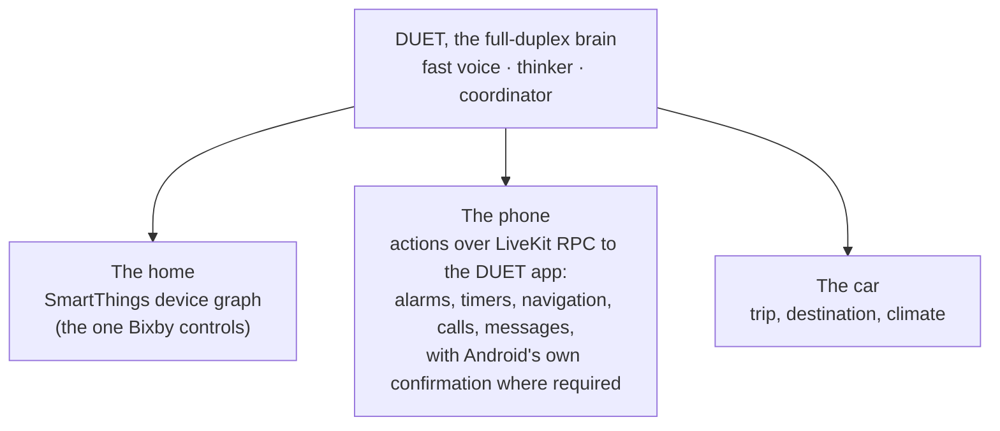

# Where does DUET matter? The research behind DUET for Galaxy

Before building the extension we asked one question: not "what is a good demo", but
**where is a real-time, full-duplex agent that acts the reason a Samsung product gets
better**, as opposed to one more voice front end on an ordinary assistant. This document
records the research, the candidates we compared, and why we built what we built
(section 6).

## 1. The test a use case has to pass

DUET's contribution is narrow and specific. It is not speech recognition, a
voice, or a bigger model; those are commodity. It is *acting correctly while a
conversation is still moving*:

- **Commit timing.** It never acts on a half-said or corrected value (commit
  gate, epochs).
- **Exactly-once actions.** It never performs a state-changing action twice
  (idempotency ledger).
- **Never silent, never lying.** A fast mind speaks while a slow mind works, and
  nothing is announced as done before the tool says so.
- **Keeps talking while work runs.** Tools and background tasks proceed while the
  conversation continues, and the agent recovers when they are slow or fail.
- **Interruptible at any moment.** The user can cut in, redirect, or take over.

So a use case earns DUET only if **most** of these hold:

1. **Voice is the primary or only safe channel.** The user's hands or eyes are
   busy. If a screen is just as easy, full-duplex is a nicety.
2. **Actions are consequential and multi-step.** They send, book, pay, unlock,
   or change devices, not just answer questions.
3. **People revise mid-sentence.** The domain naturally produces corrections,
   second thoughts and parallel requests.
4. **Tools are slow or unreliable.** Network, devices or backends lag or fail,
   so the conversation must continue around them.
5. **The assistant must keep talking while acting, and yield instantly.**

We score every candidate against these five.

## 2. What exists today (facts, with sources)

| Fact | Why it matters | Source |
|---|---|---|
| **Bixby 4.0** (One UI 8.5, launched 31 Mar 2026, rolling out on the Galaxy S26) was rebuilt around an LLM. Device functions became "callable agents", it plans multi-step tasks, controls SmartThings ("start cleaning the floor"), and uses Perplexity for web answers. It has a "Bixby Live" interface. | Samsung already ships *agentic* device control. DUET cannot win on "an LLM that calls device functions". It has to win on doing that **under real speech**: corrections, interruptions, background work, truthfulness. | [TechBuzz](https://www.techbuzz.ai/articles/samsung-s-bixby-goes-full-ai-agent-with-llm-architecture), [Droid Life](https://www.droid-life.com/2026/01/20/samsung-makes-bixby-official-in-one-ui-8-5-with-perplexity-ai/), [The Meridiem](https://themeridiem.com/ai/2026/4/8/voice-assistants-cross-into-agentic-execution-as-samsung-shifts-bixby) |
| Nothing public shows Bixby 4.0 handling mid-sentence corrections, interruptions during actions, or continued conversation while tasks run. | This is the gap DUET targets. It is unverified, so we should demonstrate it, not assert it. | same |
| **Gemini on Android Auto** (2026) reaches 250M+ vehicles. Users report it "won't stop talking", keeps talking after the driver has already chosen on the touchscreen, is inaccurate, and shows a "willingness to lie when it fails". | These complaints describe DUET's design points: brevity from the talker, yielding when the user takes over, and never claiming success without a result. | [Android Authority](https://www.androidauthority.com/android-auto-gemini-problems-3657698/), [9to5Google](https://9to5google.com/2026/07/03/gemini-android-auto-problem-keeps-listening/), [Google blog](https://blog.google/products-and-platforms/platforms/android/android-auto-gemini-tips/) |
| The **FDB-v3 paper**: Gemini Live 3.1 scores 0.353 Pass@1 on self-corrections, stays silent in 22% of cases (tools ran, nothing was said), and its pre-emptive calls "lock in the stale destination". GPT-Realtime leads at 0.600. | Independent evidence that today's best realtime models fail exactly where DUET intervenes. Our own FDB-v3 numbers will be the proof. | arXiv 2604.04847 |
| The **Gemini Live API** has non-blocking (asynchronous) function calling with response scheduling (interrupt, when idle, or silent). | "Keep talking while a tool runs" is becoming a platform primitive. DUET's value is *when* to commit and exactly-once execution, not just concurrency. | [Google Cloud docs](https://docs.cloud.google.com/gemini-enterprise-agent-platform/models/live-api/asynchronous-function-calling) |
| **Android 16 AppFunctions**: apps expose functions to agents (Samsung Gallery does on the S26). *Calling* them needs `EXECUTE_APP_FUNCTIONS`, which is privileged or role-restricted, with Gemini in private preview. | A store-installed DUET app **cannot** call Samsung apps' agent functions today. A Samsung-internal DUET could. | [Android docs](https://developer.android.com/ai/appfunctions), [Android Developers Blog](https://android-developers.googleblog.com/2026/02/the-intelligent-os-making-ai-agents.html) |
| Any third-party app can be set as the **default digital assistant** and be summoned with the Galaxy side button. ChatGPT does this. | DUET can live exactly where Bixby and Gemini live on a Galaxy phone, with no special access. | [SamMobile](https://www.sammobile.com/news/summon-chatgpt-side-button-galaxy-phones/), [Samsung support](https://www.samsung.com/us/support/answer/ANS10001575/) |
| **SmartThings public REST API** (personal access tokens, OAuth) with **virtual devices** (`smartthings virtualdevices:create`). Several community MCP servers already expose it to LLMs. | DUET can control the same Samsung home device graph that Bixby controls, through a supported API, and the changes appear in Samsung's own SmartThings app. | [SmartThings docs](https://developer.smartthings.com/docs/getting-started/authorization-and-permissions), [SmartThings CLI](https://github.com/SmartThingsCommunity/smartthings-cli), [community](https://community.smartthings.com/t/smartthings-virtual-devices-using-cli/244347) |
| **Samsung × Hyundai/Kia**: the 2026 Android Automotive infotainment integrates SmartThings. "Car-to-Home" controls home appliances from the car; "Home-to-Car" checks and conditions the car from the phone. | Samsung is actively building the car↔home bridge. A conversational layer for it is directly on Samsung's roadmap. | [Samsung Newsroom](https://news.samsung.com/global/samsung-electronics-collaborates-with-hyundai-motor-and-kia-to-further-expand-the-smartthings-ecosystem), [Hyundai](https://hyundainews.com/en-us/releases/4254), [SamMobile](https://www.sammobile.com/news/smartthings-lets-control-home-appliances-hyundai-kia-cars/) |
| **HARMAN** (a Samsung subsidiary) ships the Ignite in-vehicle platform, on which OEMs deploy voice agents (Bixby, Alexa and others). | A realistic path from prototype to product for an in-car orchestration layer. | [Tech Monitor](https://techmonitor.ai/techonology/ai-and-automation/harman-ignite-connectivity-smart-cars-iot), [SoundHound × HARMAN](https://www.soundhound.com/newsroom/press-releases/soundhound-and-harman-join-forces-to-deliver-an-effortless-conversational-voice-ai-experience-to-auto-customers/) |
| **Samsung SDS AI Contact Center** runs voicebots that answer inquiries, screen applications and process requests. In the wider market, voice AI handles 19% of inbound contact-center volume (2026), and barge-in is a named pain point. | A B2B line where "don't double-book, don't talk over the caller, hand off cleanly" is money. | [Samsung SDS AICC](https://www.samsungsds.com/en/aicc/aicc.html), [Maven AGI](https://www.mavenagi.com/blog/voice-ai-statistics-customer-service), [Decagon](https://decagon.ai/glossary/what-is-voice-agent-barge-in) |
| **Galaxy XCover7 Pro / Tab Active5 Pro** target frontline workers, with push-to-talk, glove and wet-touch support. | Hands-busy enterprise users with procedures, readings and orders. | [Samsung Newsroom](https://news.samsung.com/global/samsung-introduces-galaxy-xcover7-pro-and-galaxy-tab-active5-pro-ruggedized-devices-for-frontline-excellence) |
| **Gemma 4** (April 2026): E2B, E4B, 26B MoE and 31B dense, with native function calling. | A fully local "offline DUET" fits in 48 GB, in line with Samsung's on-device AI direction. | [Google](https://blog.google/innovation-and-ai/technology/developers-tools/gemma-4/) |

## 3. Can DUET work alongside Bixby?

**Direct integration: not with public means today.**
- There is no public API for a third-party app to send commands to Bixby 4.0
  or to call its device agents.
- The AppFunctions caller permission is privileged.
- Bixby Capsules (2019 Developer Studio) run the other way: Bixby calls a
  developer's service, not the reverse.
- Samsung Modes & Routines has an undocumented content provider that can run a
  routine by UUID. Tasker users found it; it is not a supported API.
- Driving Bixby's UI through an accessibility service is fragile and against
  Play policy.

None of these is a sound foundation for a product.

**What is feasible, and close to the idea.** Split the system the same way the
idea does, using supported mechanisms:

- **On the phone.** DUET is the Galaxy's default digital assistant (side
  button). The phone is the ears and mouth, and executes device actions on
  request: the agent calls the phone over LiveKit RPC, which LiveKit supports
  for exactly "forward LLM function calls to your client". This is the "Bixby
  executes device-level actions" role, played by the DUET app itself.
- **At home.** SmartThings devices, virtual or real, are driven by DUET, and
  every change shows up live in Samsung's own SmartThings app. Bixby 4.0 would
  control the same graph.
- **Inside Samsung (the product story).** DUET is not a competing assistant but
  a **layer**. Its coordinator (commit gate, ledger, failure policy) and
  fast-voice/thinker split can wrap Bixby 4.0's callable agents unchanged; the
  binding to Bixby needs Samsung-internal access.

**Prototype vs product.** The prototype runs today with public mechanisms
(Android interfaces over LiveKit RPC). A product version would replace the
phone-RPC layer with Bixby's callable agents or AppFunctions, which Samsung
controls. Nothing in the demo pretends to be Bixby.

## 4. Candidate directions

The score is how many of the five conditions from section 1 hold (✔ strong,
~ partial, ✘ weak).

### A. DUET Co-Driver: in-car assistant with Car-to-Home orchestration
- **User problem.** A driver can only use voice. Plans change mid-drive: stops,
  destinations, who to tell, what to do at home. Tasks span the car
  (navigation, charging), the phone (messages, calls, calendar) and the home
  (AC, lights, garage, vacuum).
- **Existing solutions fall short.**
  - Gemini on Android Auto is conversational but, per 2026 user reports,
    chatty, doesn't yield, and misreports failures.
  - Bixby and Gemini don't do Car-to-Home orchestration by conversation.
  - Hyundai/Kia's Car-to-Home is touch and voice-command, not a conversation.
- **Why full-duplex.** The agent talks (guidance, confirmations) while
  listening. Drivers interrupt constantly. Passengers speak and are not
  addressing the assistant. Actions run while driving continues.
- **Why DUET.**
  - It never acts on a half-said destination ("the Starbucks on 5th, no, the
    one by the office").
  - It never sends the ETA message twice.
  - It keeps speech to one short line (the exact complaint about Gemini), and
    stops the moment the driver speaks or takes over.
  - It holds a background task, "when I'm ten minutes out, turn on the AC and
    open the garage", across the rest of the conversation.
  - It recovers from dead zones (tool timeouts) without lying.
- **Tools.**
  - Routing and places (open map services), weather, SmartThings (real API with
    virtual devices).
  - Simulated: messages and calendar.
- **Samsung relevance.** Very high: HARMAN Ignite, Hyundai/Kia × SmartThings,
  Galaxy as the in-car device.
- **Business value.** Driver-distraction reduction is a regulatory and
  brand-level issue for OEMs, and conversational orchestration is a sellable
  platform feature for HARMAN.
- **Demo potential.** Excellent: a map that re-routes live, the home devices
  changing in the real SmartThings app on a phone in frame, the driver cutting
  the agent off mid-sentence.
- **Complexity.** Medium-high: a dashboard UI, several APIs, and background
  triggers on a simulated drive.
- **Weaknesses.**
  - It is not in a real car; it runs on a simulated route (fine if said).
  - The in-car space is crowded (Google, Cerence, SoundHound, Mercedes).
  - Safety claims must stay modest.
- **Score.** 1 ✔ · 2 ✔ · 3 ✔ · 4 ✔ · 5 ✔.

### B. Galaxy DUET: the full-duplex layer next to Bixby on the phone
- **User problem.** Everyday multi-step phone tasks said naturally while doing
  something else: "Set a timer for twelve, no, fifteen minutes. Text Priya I'll
  be late. Turn on the hall lights. And what's the weather at six?"
- **Existing solutions fall short.** Bixby 4.0 and Gemini Live now act on
  devices, but there is no evidence they handle corrections mid-action or keep
  talking while tasks run. FDB-v3 shows even the best realtime models lose
  40–65% of self-corrections.
- **Why full-duplex.** Moderate. A screen is available, so voice is a
  convenience unless the user is busy.
- **Why DUET.** Exactly-once actions and commit timing matter because the
  actions are real (messages, alarms, devices).
- **Tools.** Android intents via LiveKit RPC (a small native plugin in a
  Capacitor app) and SmartThings.
- **Samsung relevance.** Very high, and the closest to "DUET alongside Bixby".
- **Demo.** Good on a Galaxy S26: side button, and the phone actually sets the
  timer.
- **Complexity.** High in our window: native Android intents through RPC,
  permission and confirmation flows, and device testing.
- **Weaknesses.**
  - Android requires user confirmation for SMS or calls from third parties.
  - It can look like "yet another assistant" competing with Bixby.
  - The deepest integration (Bixby agents) is not publicly possible.
- **Score.** 1 ~ · 2 ✔ · 3 ✔ · 4 ~ · 5 ~.

### C. SmartThings home (the original recommendation)
- **User problem.** Multi-device routines, spoken naturally, with appliances
  that take time (washer, oven) and devices that fail (offline).
- **Existing solutions.** Bixby 4.0 and Alexa+ already do LLM smart-home
  control. DUET's edge is the full-duplex behaviour: background appliance
  cycles while conversing, recovery when a device is offline, and a
  human-in-the-loop confirmation for the door lock.
- **Feasibility.** High (SmartThings API with virtual devices).
- **Samsung relevance.** High.
- **Demo.** Good (the real SmartThings app in frame), but less dramatic than a
  car. At home a screen is usually nearby, so the case for "voice must work"
  is weaker.
- **Score.** 1 ~ · 2 ✔ · 3 ~ · 4 ✔ · 5 ~.

### D. Samsung service line: appliance support and technician booking (Samsung SDS AICC)
- **User problem.** A customer calls about a washer error. They spell a model
  number, correct themselves ("it's the dryer, not the washer"), need
  troubleshooting, then a technician slot, maybe parts. Often they are standing
  at the appliance with their hands full.
- **Existing solutions fall short.** IVRs and today's voicebots talk over
  callers, re-ask, double-book, and fail at handoff.
- **Why DUET.** Commit timing on bookings, exactly-once scheduling, truthful
  progress while backends are slow, and a clean human handoff.
- **Business value.** The clearest of all (containment and handle time), and
  Samsung SDS sells AICC.
- **Weaknesses.**
  - It sits closest to the benchmark's own style (support and booking), so it
    reads as "more of the benchmark".
  - It is a phone call, not a Samsung device experience, so there is less "wow".
- **Score.** 1 ~ · 2 ✔ · 3 ✔ · 4 ✔ · 5 ✔.

### E. Kitchen / Bespoke AI appliances (Samsung Food + oven + Family Hub)
- **Fair challenge.** Timers and recipe step-through already work well with
  single commands on today's assistants. Full-duplex adds interrupting a
  read-out ("wait, how much butter?") and parallel timers. That is useful but
  marginal.
- **Where it gets strong.** Orchestrating appliances ("preheat to 200, no, 180
  fan") plus a shopping list plus substitutions via web search. Even then, a
  screen (Family Hub) sits right there.
- **Verdict.** A pleasant demo, weak necessity. Not our lead.
- **Score.** 1 ✔ · 2 ~ · 3 ~ · 4 ~ · 5 ~.

### F. Frontline worker on Galaxy XCover / Tab Active
- **User problem.** A technician with gloved hands follows a procedure, reads
  values aloud, logs them, orders a part, and asks questions mid-step in a
  noisy environment.
- **Why DUET.** Commit timing on logged readings ("42.5, no, 45.2 psi"),
  exactly-once work orders, and long lookups that shouldn't block the
  procedure.
- **Assessment.**
  - Business value: real (enterprise, Knox).
  - Demo: plausible but abstract for judges.
  - Tools: all mocked (no public work-order system).
- **Score.** 1 ✔ · 2 ✔ · 3 ✔ · 4 ~ · 5 ✔.

### G. Accessibility-first phone control (blind, low-vision or motor-impaired users)
- **Assessment.**
  - Social value: the highest. Interrupting long read-outs is central to
    screen-reader use, and corrections are frequent.
  - Feasibility: poor in our window. Deep phone control needs accessibility
    services (a policy and ethics minefield), and a credible demo needs real
    users.
- **Verdict.** A strong "what we'd do next" story, not the demo.

### H. Wearables and TV (Galaxy Watch, Buds, Vision AI TVs)
- **Assessment.** These are channels rather than use cases. Buds are the natural
  audio front end for B or A; a TV has weak necessity. Mention them as
  extensions of the chosen direction.

## 5. Summary

| Direction | Five-condition fit | Samsung relevance | Feasible in the hackathon | Demo impact | Main risk |
|---|---|---|---|---|---|
| **A. Co-Driver with Car-to-Home** | 5/5 | Very high (HARMAN, Hyundai/Kia × SmartThings) | Yes, simulated drive | Very high | Scope; crowded market |
| **B. Galaxy DUET next to Bixby** | 3/5 | Very high | Partly (Android native work) | High on a real S26 | Time; Android confirmation flows |
| **C. SmartThings home** | 3/5 | High | Yes | Medium | "Bixby 4.0 already does this" |
| **D. Samsung service agent (AICC)** | 4/5 | High (SDS) | Yes | Medium | Too close to the benchmark |
| E. Kitchen | 2/5 | Medium | Yes | Medium | Weak necessity |
| F. Frontline | 4/5 | Medium-high | Yes (mocked) | Medium-low | Abstract for judges |
| G. Accessibility | 4/5 | High | No | High | Feasibility and ethics |

**The shape of a strong answer.** A plus the useful half of B and C:

- A single DUET brain.
- The phone as its ears and mouth (Galaxy default assistant).
- The **car as the stage**, because that is where voice is mandatory and
  today's assistants are measurably failing.
- **Samsung's own SmartThings graph as the reach into the home.**

It shows every DUET property under real pressure, sits on a live Samsung
initiative (Car-to-Home), and keeps the Bixby story honest: DUET is the
full-duplex layer Bixby's agents could run under.

## 6. What we built

**DUET for Galaxy**: one DUET brain, with the Galaxy phone as its ears, mouth and hands,
in three modes that each put a different pressure on the design.

| Mode | From the analysis | What it proves |
|---|---|---|
| **Assistant** | Direction B, the full-duplex layer next to Bixby | Corrections mid-sentence on real phone actions (alarms, brightness, apps, Maps, calls, messages); troubleshooting from the phone's real readings that the user can interrupt |
| **Care** | Condition 1 at its strongest: an older person for whom voice is the natural channel | Consequential, exactly-once actions: a double-dose guard on medicines, family calls and alerts, reminders, a daily check-in |
| **Drive** | Direction A, the co-driver with Car-to-Home | Eyes-busy use: a destination changed mid-sentence, arrival-time messages, the car's climate and the home from the car |

Real Android interfaces carry the phone actions (alarms, battery and screen readings,
installed apps, brightness and timeout, settings, Maps navigation, calls, messages). The
home, the medicine schedule and the car are simulated inside the app, and the demo says
so. The same coordinator gates every action, and the app's live timeline shows each
step as it happens. Build, run and demo instructions: [app/README.md](../app/README.md).
