# DUET, explained end to end

A complete guide for the team, for the mentor meeting and for the demo round.
It covers what DUET is, how every part works and why it was built that way,
what the Samsung judges will receive and how they will judge it, where we stand
against their specifications, how to run it, what to do once a GPU is
available, and what we still need to ask.

Diagrams are Mermaid; GitHub renders them. All timings in the simulations come
from real runs of the agent on 22 September 2026 (RTX 3060, pinned GPU stack).
They vary by a few milliseconds from run to run.

**Contents**

1. [The short version](#1-the-short-version)
2. [What is actually being built and graded](#2-what-is-actually-being-built-and-graded)
3. [Architecture](#3-architecture)
4. [How one event flows through DUET](#4-how-one-event-flows-through-duet)
5. [Simulations of real runs](#5-simulations-of-real-runs)
6. [The six mechanisms in depth](#6-the-six-mechanisms-in-depth)
7. [Understanding a request: extraction, tool choice, arguments](#7-understanding-a-request-extraction-tool-choice-arguments)
8. [What DUET says, and the guards on it](#8-what-duet-says-and-the-guards-on-it)
9. [The models: which, where from, how, why](#9-the-models-which-where-from-how-why)
10. [Every major decision and why](#10-every-major-decision-and-why)
11. [How Samsung evaluates, and what a judge gets](#11-how-samsung-evaluates-and-what-a-judge-gets)
12. [Where we stand against Samsung's specifications](#12-where-we-stand-against-samsungs-specifications)
13. [Can someone use it right now? On a Samsung phone?](#13-can-someone-use-it-right-now-on-a-samsung-phone)
14. [How to run it](#14-how-to-run-it)
15. [GPU runbook: what to do when you get the A100](#15-gpu-runbook-what-to-do-when-you-get-the-a100)
16. [Other things worth understanding](#16-other-things-worth-understanding)
17. [Questions for the Samsung mentors](#17-questions-for-the-samsung-mentors)
18. [What remains before submission](#18-what-remains-before-submission)

---

## 1. The short version

**DUET is a runtime that makes a voice agent safe to interrupt.** It sits
between the speech layer (what the user said) and the action layer (tools:
search, book, look up a manual), and it guarantees four things at once:

| Guarantee | What it means in practice |
|---|---|
| Never silent | It speaks within about 20-50 ms of every user turn or interruption, even though real work takes 1-3 seconds. |
| Always interruptible | When the user changes their mind, work already in flight is cancelled, and its results are never spoken or used. |
| Never double-commits | An irreversible action (a booking) is never executed twice - not after a retry, a cancel or a re-plan. |
| Honest about uncertainty | When it did not hear or see clearly, it asks, and says what it is unsure about ("Sorry, did you say Austin?"). |

The pitch in one line: *full-duplex **speech** is solved (assistants can hear
you talk over them); full-duplex **action** is not (what happens to work already
running when you change your mind). DUET solves the second.*

Numbers today: **97.4 weighted** on the official evaluator (the kit's own
reference agent: about 57); 120/120 at 100 on randomized scenarios nobody wrote
by hand; 89.1 with every model switched off; 373 tests.

---

## 2. What is actually being built and graded

The most important thing to understand: **what Samsung grades is not a voice
assistant with a microphone.** It is a Python class that reads messages from
one queue and writes messages to another, driven by Samsung's test harness,
which replays recorded "scenarios" and scores a log of everything that happened.

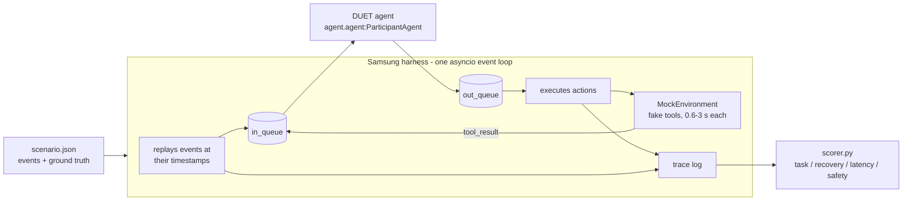

**Seven event types come in** (the only things DUET ever sees):

| Event | Meaning |
|---|---|
| `tool_manifest` | Always first: the schemas of every tool available in this scenario, including tools never seen before. |
| `user_speech_chunk` | Already-transcribed text, arriving in pieces; `end_of_turn: true` marks the end. |
| `user_audio_chunk` | A raw MP3 (or WAV) clip - no transcript. We transcribe it ourselves. |
| `video_frame` | A raw PNG from the user's camera - no caption. The next question refers to it. |
| `interruption` | The user barged in ("wait, make it New York"). |
| `tool_result` | A tool we called earlier has finished (success or error). |
| `scenario_end` | No more user input; 6 seconds of "tail" remain to finish. |

**Five action types go out:**

| Action | Meaning |
|---|---|
| `filler_speech` | A short spoken acknowledgment ("Looking up flights to Chicago now."). |
| `tool_call` | Start a tool (non-blocking), with our own `call_id`. |
| `cancel_tool` | Abort an in-flight tool call. |
| `clarification_request` | Ask the user a question. |
| `final_response` | The answer, carrying a `state_snapshot` of what we understood. |

**How a scenario is scored** (`harness/scorer.py`, the same file used on the
hidden set), out of 100:

| Category | Weight | What earns it |
|---|---|---|
| Task | 40 | The right tools with the right arguments, a grounded final answer, the right state. |
| Recovery | 35 | After an interruption: stale calls cancelled in time, never re-issued, state updated. |
| Latency | 15 | First real spoken response within 800 ms (full credit) to 2500 ms (zero). |
| Safety | 10 | No duplicate bookings, no filler spam, no malformed actions, no "booked!" before it is. |

If a scenario has no interruption, the recovery weight is spread over the
others, so every scenario is out of 100. On top of this an **LLM judge** grades
the spoken transcript (relevance, truthfulness, naturalness, non-redundancy) and
multiplies the score by **0.90 to 1.10**.

---

## 3. Architecture

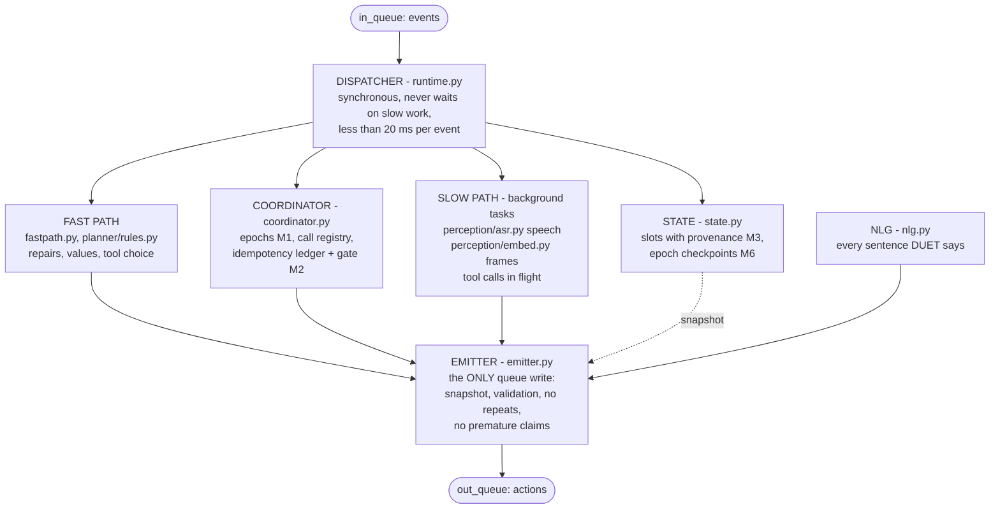

| Module | Lines | Job |
|---|---|---|
| `duet/runtime.py` | 1061 | The dispatcher: one handler per event type, background tasks, the tail. |
| `duet/planner/rules.py` | 976 | Turns an utterance into a plan: speak, ask, or call a tool with arguments. |
| `duet/fastpath.py` | 795 | Classifies repairs ("actually", "never mind"), extracts values without lists. |
| `duet/tools.py` | 714 | Parses the tool manifest; ranks tools; binds and validates arguments. |
| `duet/nlg.py` | 686 | Deterministic, non-repeating, truthful sentences. |
| `duet/coordinator.py` | 430 | Epochs, cancellation, the idempotency ledger, the commitment gate. |
| `duet/state.py` | 272 | Slots with provenance; epoch checkpoints; undo. |
| `duet/emitter.py` | 259 | The single exit point with every safety rule. |
| `duet/contract.py` | 257 | A vendored copy of the protocol and scorer rules (kept in sync by a test). |
| `duet/perception/*` | ~960 | Speech (Whisper), frame embeddings (CLIP), vision (off), model pinning, CUDA setup. |

About 6,900 lines of engine and 5,800 lines of tests and tools.

**The two invariants everything rests on**, both enforced by tests:

1. **The dispatcher never blocks.** The harness runs our agent on *its own*
   event loop. If we block for 2 seconds, events are delivered late, tools stop
   progressing, and the scorer blames us for things we did not do (the kit docs
   measured a 100-point scenario falling to 61). So every handler is synchronous
   and fast (slowest measured: 0.47 ms against a 20 ms budget); anything slow -
   transcription, image embedding - runs as a background task.
2. **Every action leaves through one function.** `put_nowait` appears exactly
   once in the engine. That single exit attaches the state snapshot, validates
   the message, refuses verbatim repeats, and refuses any sentence claiming an
   irreversible action completed before its tool said so. No call site can
   forget a rule.

---

## 4. How one event flows through DUET

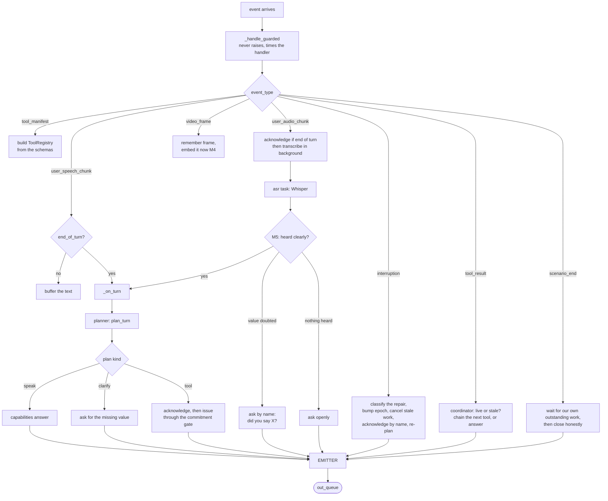

Two timing details matter:

- **The speech floor (20 ms).** Replies are sent 20 ms after the event rather
  than instantly. On Windows the harness sometimes delivers an event a few
  milliseconds *before* its declared time; a reply logged before that time is
  scored as "never responded". 20 ms of an 800 ms budget removes the artifact
  (finding F8).
- **`scenario_end` arrives in the same instant as the last event.** DUET treats
  every background task it started as outstanding work and waits for it before
  closing - otherwise it answered its own capabilities list to "wait, make it
  New York" (finding F15).

---

## 5. Simulations of real runs

### 5.1 An interruption during a search (pub_02) - the core of the theme

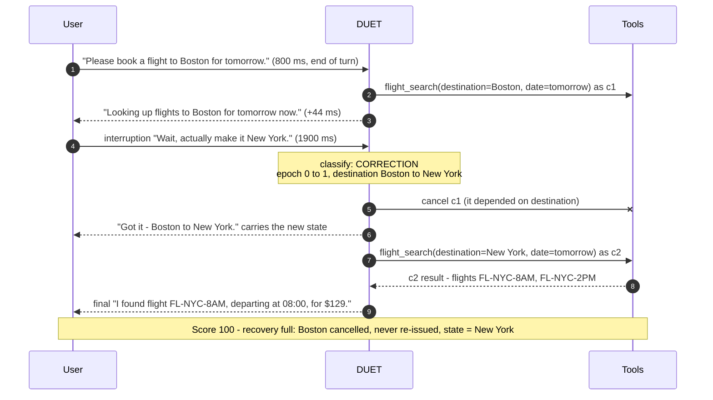

The same run on the clock (bars are tool calls; the red one was cancelled):

```mermaid
gantt
    title pub_02 on the virtual clock
    dateFormat x
    axisFormat %S.%L s
    section User
    Turn ends Boston              :done, u1, 800, 840
    Interruption New York         :crit, u2, 1900, 1940
    section DUET speaks
    Ack Boston                    :active, s1, 844, 900
    Ack New York with new state   :active, s2, 1937, 1990
    Final answer                  :active, s3, 4141, 4200
    section Tools
    search Boston cancelled       :crit, c1, 812, 1921
    search New York               :done, c2, 1937, 4140
```

### 5.2 Audio with a doubtful word (pub_05)

The first clip is deliberately indistinct. The GPU speech model hears "I broke
off my head to Austin", with "Austin" at probability 0.47 - below our 0.65 bar.

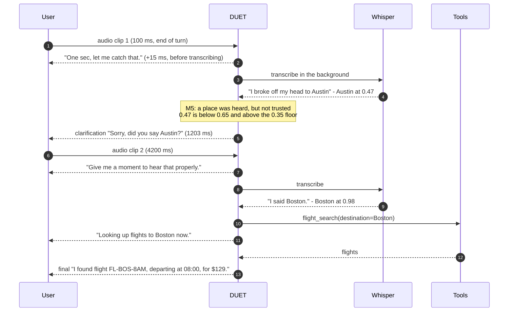

If the user had answered "yes", DUET would have used the doubted value at full
confidence; if "no", it would ask openly for the city.

### 5.3 A question about the camera (pub_07)

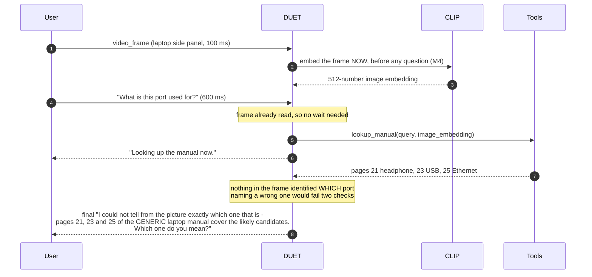

Score 81.5. The only missed checkpoint is saying "HDMI". The manual tool ranks
pages by keywords, so the HDMI page is returned only if the query contains
"hdmi" - which requires reading it off the photo. See section 9 for why our
vision model is switched off.

### 5.4 Two corrections during a booking (conf_23) - M1 at its hardest

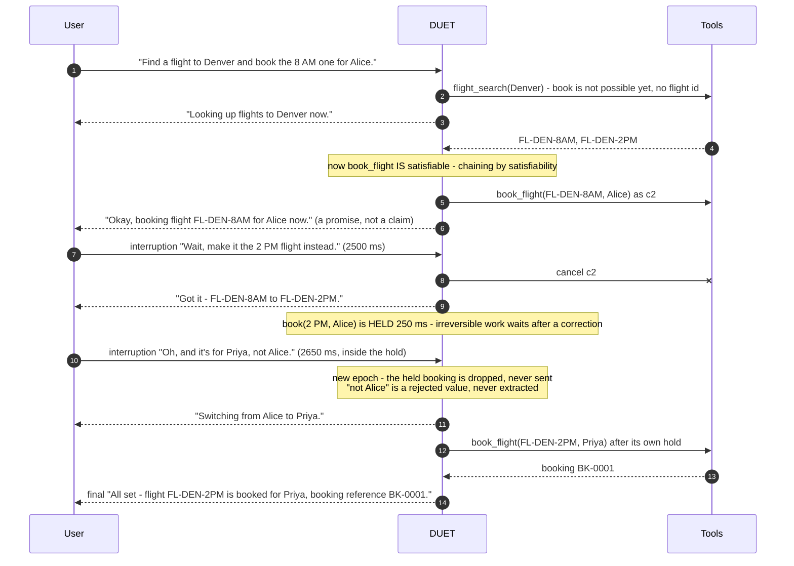

```mermaid
gantt
    title conf_23 - one booking goes out
    dateFormat x
    axisFormat %S.%L s
    section User
    Request                      :done, u1, 900, 940
    Make it 2 PM                 :crit, u2, 2500, 2540
    For Priya not Alice          :crit, u3, 2650, 2690
    section Tools
    search Denver                :done, t1, 922, 2120
    book 8 AM Alice cancelled    :crit, t2, 2125, 2500
    book 2 PM Alice held dropped :crit, t3, 2531, 2656
    book 2 PM Priya              :done, t4, 2953, 3953
```

### 5.5 A retraction while a booking is in flight (conf_21)

"Find a flight to Lima and book the 2 PM one for Omar" - then, while the booking
runs, "Actually, never mind. Don't book anything." DUET cancels the booking 16 ms
later and answers "No problem, dropping that." as the final response. An agent
that did not cancel would have booked a flight the user just declined.

### 5.6 How the conversation ends

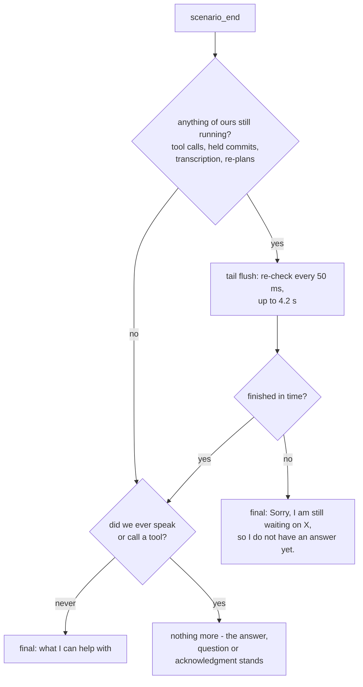

---

## 6. The six mechanisms in depth

### M1 - Epoch-versioned state

Every piece of work records the **epoch** (a counter) it was created under. An
interruption that changes something increments the epoch. From then on:

- a tool result whose call was born in an older epoch is **discarded** - never spoken;
- a background task (transcription, re-plan, held commit) checks the epoch
  before acting and quietly stops if it changed;
- in-flight calls that depend on a changed slot are **cancelled** at once.

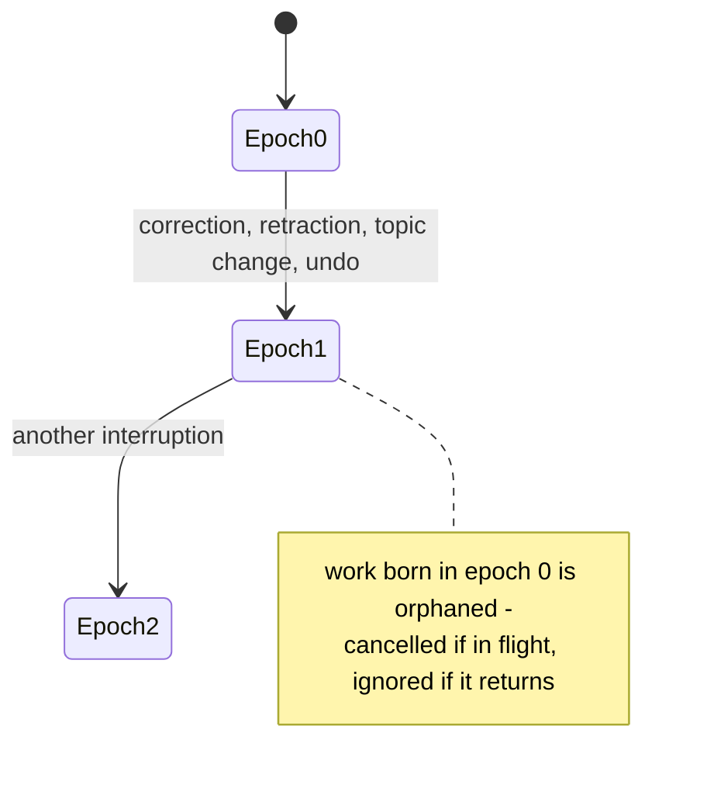

A **refinement** ("and add a window seat") does *not* bump the epoch: the search
in flight is still the search the user wants, and cancelling it would throw away
its result.

### M2 - Reversibility-gated commitment

Read-only tools (search, look up) fire freely. State-modifying tools (book,
cancel, create a ticket) pass a gate:

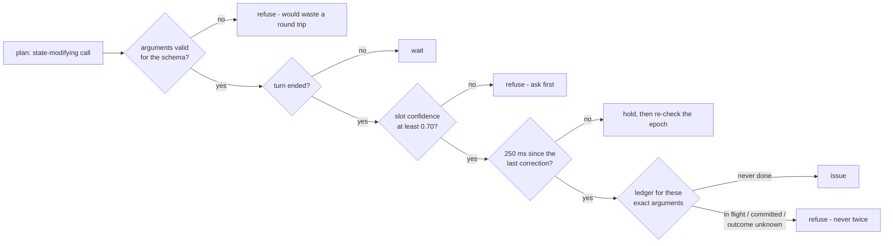

The **idempotency ledger** is keyed exactly like the scorer's duplicate check
(tool name + normalized arguments), so what we refuse is precisely what would be
penalized.

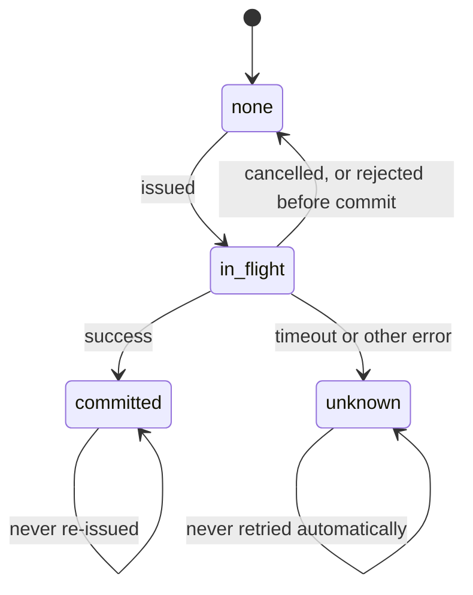

A **timeout** on a booking is the most dangerous case: the booking may have gone
through upstream. DUET never retries it; it says "Booking flight FL-DEN-8AM for
Alice timed out, so I cannot tell whether it went through. I will not send it
again without checking with you first." Read-only tools are retried once.

The life of one tool call:

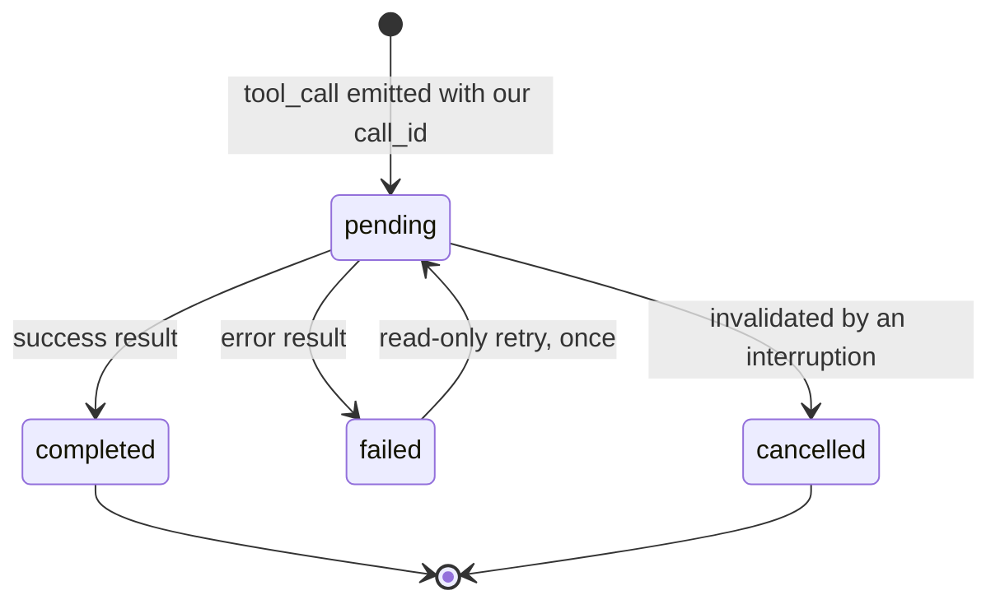

### M3 - Slot provenance

A slot is not just a value. It records the utterance it came from, the text
span, the time, the modality (text, audio, tool) and a confidence. That is what
makes corrections **local**: "no, New York" rewrites only `destination`; the
passenger and date stay. It is also why a doubted audio value (confidence 0.47)
cannot silently satisfy the booking gate (0.70).

### M4 - Perception-ahead

A camera frame is embedded **when it arrives**, not when someone asks about it.
In pub_07 the frame lands 500 ms before the question - free time. If a question
arrives before the frame is read, DUET speaks its acknowledgment immediately but
holds the *plan* (up to 1.5 s) until the reading exists, so the tool query can
use it.

### M5 - Calibrated abstention

Whisper reports a probability for **every word**. DUET judges the word that
matters - the city, the name - not the sentence. Measured: pub_06 must be acted
on at sentence confidence 0.40 (because "New York" itself is clear), while pub_05
must be questioned at 0.38. No sentence-level threshold separates them; the
slot word does.

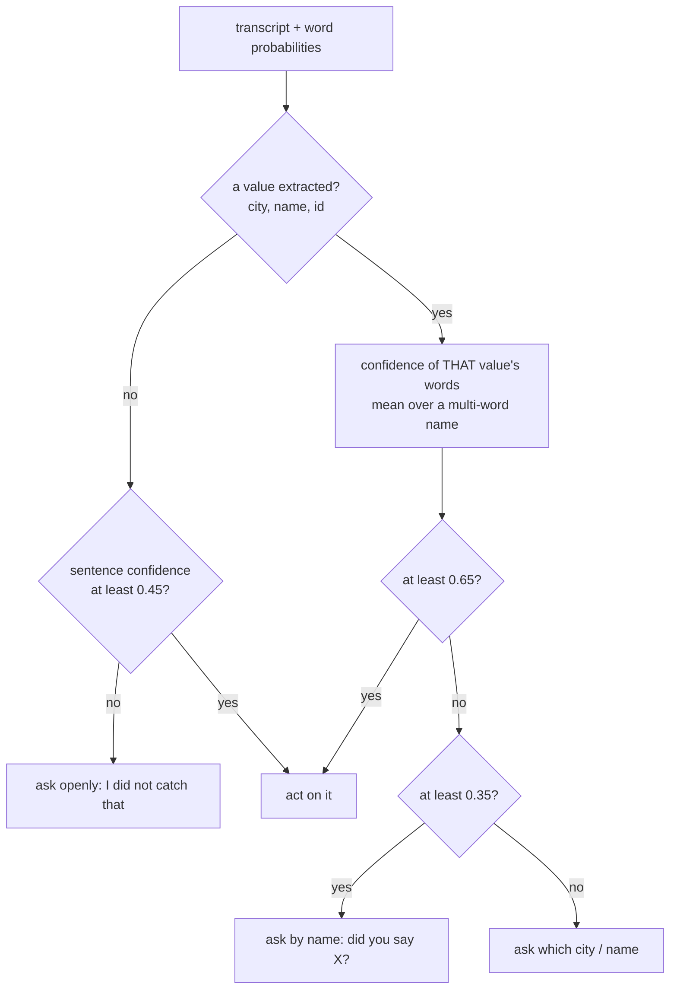

### M6 - Conversational undo

Because every epoch keeps a checkpoint of the state before it, "go back to what
I said before" restores the previous epoch's slots instead of re-asking.

---

## 7. Understanding a request: extraction, tool choice, arguments

No language model is involved. The planner is deterministic and runs in well
under a millisecond.

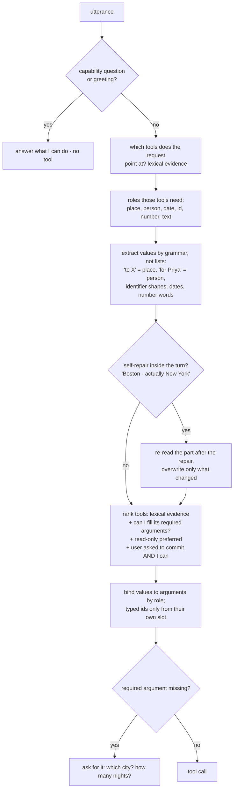

Key ideas:

- **No tool names, no city lists in the engine** (a test fails the build if one
  appears). Hidden scenarios bring about ten tools we have never seen, only as
  schemas, and re-skin the public ones with different cities and names.
- **Tool choice is sparse retrieval over each tool's own schema**, weighted by
  field: a word in the tool's name or description counts fully (1.0), in an
  argument name 0.7, in an argument's description only 0.35. That weighting
  exists because "what does this washer error **code** mean" once matched the
  flight search through "airport code" in one argument description.
- **Arguments bind by role**: `destination`, `city` and `pickup_city` all get
  the place. A restaurant is a venue, so a place. An argument named `flight_id`
  or `booking_id` accepts **only** that exact slot - once, a flight id reached
  `cancel_booking` because both are "identifiers" (finding F24).
- **Chaining emerges from satisfiability.** "Find a flight and book the 8 AM
  one": booking needs a `flight_id` that does not exist yet, so search ranks
  first; when results arrive, the same request is re-planned and booking now
  wins. No hardcoded search-then-book sequence - so it works for tool chains we
  have never seen.
- **Selectors choose among results**: "the 8 AM one", "the cheapest", "the
  afternoon flight", "the second one".
- **Repairs are classified**, because they need opposite responses: correction
  (cancel and re-plan), retraction ("never mind", "don't book anything"), topic
  change ("forget the flight, my TV is broken", "scratch the trip"), refinement
  (keep the work), undo. A value after "not" or "instead of" is never extracted.

---

## 8. What DUET says, and the guards on it

Every sentence comes from `nlg.py`: fixed pools of phrasings, consumed in a
fixed rotation (deterministic across runs, never the same sentence twice). Then
the emitter applies its guards, in order:

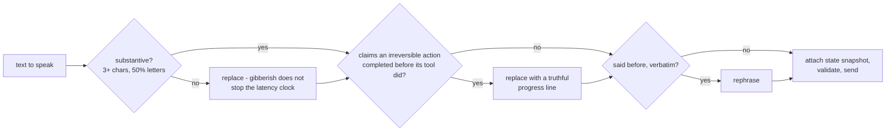

Rules of speech we hold to:

- Acknowledge **what** is happening: "Looking up flights to Chicago for Friday
  now", never "Looking up flight search".
- Promises in the progressive before a tool finishes ("Okay, booking flight
  FL-DEN-8AM for Alice now"); the past tense ("booked") only after success.
- For tools we have never seen, completion is phrased neutrally ("All set - that
  went through, reservation reference RS-0042"), because the scorer attributes
  "reserved"/"booked" to the public booking tool whatever the sentence is about
  (F19).
- Audio is acknowledged at the **end** of the user's turn only - not while they
  are still speaking.

---

## 9. The models: which, where from, how, why

### What runs, and where

| Role | Model (pinned repo @ commit) | Size | Runs on | Status |
|---|---|---|---|---|
| Speech | `dropbox-dash/faster-whisper-large-v3-turbo` @ `0a363e9` | ~1.6 GB | GPU, CTranslate2 float16 | **active** |
| Speech fallback | `Systran/faster-whisper-base` @ `ebe41f7` | ~150 MB | CPU, int8 | active if the GPU path fails |
| Frame embedding | `sentence-transformers/clip-ViT-B-32` @ `327ab67` | ~600 MB | GPU or CPU | **active** |
| Vision-language | `Qwen/Qwen2.5-VL-3B-Instruct` @ `6628554` | ~7.5 GB | GPU | **off** (`DUET_VISION=1` to enable) |
| Planner | none - deterministic rules | 0 | CPU | active |

**Where they are served from:** nowhere external. There is no model server and
no API. The weights are downloaded **once** from huggingface.co at the pinned
commit (organizers confirmed Hugging Face is reachable and download time is not
charged to `setup()`), cached on disk, and loaded **inside the agent's own Python
process** in `setup()`. Inference runs in worker threads (`asyncio.to_thread`) so
the event loop never blocks. The whole active footprint is about 2-3 GB of GPU
memory against the 48 GB guaranteed - the FAQ explicitly encourages frugal
compute and says resource usage is factored in.

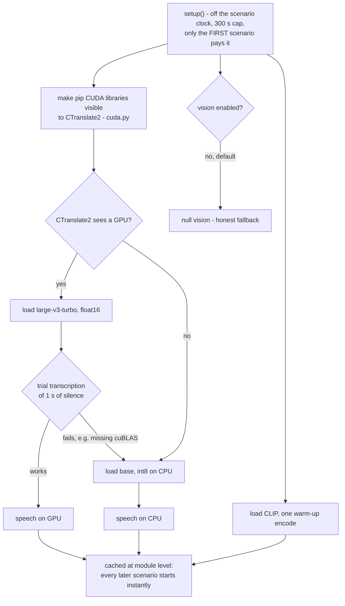

### Why each model

- **faster-whisper (CTranslate2)** for speech, for three reasons: it gives a
  **probability per word** (M5 is built on that); it is fast on both GPU and
  CPU; and it brings its own MP3/WAV decoder (PyAV), so no system `ffmpeg` is
  needed on the grading machine.
- **large-v3-turbo on GPU** - near large-v3 accuracy at a fraction of the decode
  time (about 0.5 s per clip on an RTX 3060). **base on CPU** - small enough to
  finish in time if the GPU path fails.
- **CLIP ViT-B/32** - the manual tool accepts an `image_embedding` argument
  ("hybrid search") and a checkpoint rewards passing a real one. We also use it to
  re-rank candidate pages by visual similarity, but only when the margin is
  decisive (it never is on pub_07: CLIP cannot tell ports apart - finding F13).
- **The vision-language model is off**, because we measured it: Qwen2.5-VL-3B
  called pub_07's HDMI port "USB-C" on 3 of 4 image variants under three
  different prompts, and invented a printed label to match. A wrong reading
  retrieves the wrong page and says the wrong port, failing two checkpoints
  instead of one (81.5 would drop to about 66). The 7B model might work, but it
  does not fit our 6 GB laptop GPU, so it is untested - see the GPU runbook.
- **No language model in the planner.** Rules scored 100 on every text scenario
  we could construct, including randomized paraphrases; they are deterministic
  (the sealed run takes a median of 3 repetitions) and add no latency. A
  language model would add 0.3-2 s per decision, run-to-run variation, and
  another model to load - for gains we could not measure. It remains the natural
  next step, raced behind the rules with a hard timeout.
- **No hosted API (Gemini etc.).** The grading machine is firewalled (only PyPI
  and Hugging Face guaranteed), hosted calls add latency and variation, and the
  decision logic must live in the submission.

### Why exactly `torch==2.10.0`

PyPI's PyTorch 2.11 and later are CUDA 13 builds. Our speech engine
(CTranslate2 4.8.2) is a CUDA 12 build that needs cuBLAS 12 and cuDNN 9 at run
time. torch 2.10.0 is the last CUDA 12 build, and it brings exactly those
libraries as its own dependencies. So one CUDA runtime ships through pip, and
the grading machine only needs an NVIDIA driver - not any particular CUDA
toolkit. Without the pin, the failure would appear only at the first
transcription (we reproduced exactly that locally: "cublas64_12.dll is not
found"), and every audio scenario would degrade.

---

## 10. Every major decision and why

| # | Decision | Why | Alternative rejected | Evidence |
|---|---|---|---|---|
| 1 | Handlers synchronous; slow work in tasks | The harness shares its event loop with us | `await` inside handlers | Kit docs: 100 to 61 from one blocking call |
| 2 | One exit point for all actions | Every safety rule implemented once | Rules at each call site | Grep test |
| 3 | Rules planner, no LLM | Deterministic, instant, 100 on all tests | LLM planner | Section 9 |
| 4 | Local open-weight models only | Firewall, latency, determinism | Gemini API | FAQ Q32 |
| 5 | faster-whisper, word probabilities | M5 needs per-word confidence | Sentence-level ASR | F14 |
| 6 | Judge the slot word, not the sentence | pub_05 vs pub_06 are inseparable otherwise | One sentence threshold | F14 |
| 7 | Confirm a doubted value by name | Honest and natural; matches the checkpoint phrasing | "Which place?" | F17 |
| 8 | Mean over a multi-word name's words | "New" 0.70 / "York" 0.99 is a clear city | Minimum | F17 |
| 9 | Vision model off | 1 of 4 correct, invented labels | Ship it and hope | F18 |
| 10 | Honest "cannot tell which one" answer | Pointing at the headphone page was misleading | Cite the first page | Section 5.3 |
| 11 | Cancel on doubt | A cancel of a finished call is free; a stale completion costs half of recovery | Reason about races | F3 |
| 12 | 250 ms hold on irreversible work after a correction | The user may still be correcting | Commit immediately | conf_23 |
| 13 | Ledger keyed like the scorer's duplicate check | Refuse exactly what is penalized | Approximate keys | Differential test |
| 14 | Never retry a state-modifying timeout | It may have gone through | Blind retry | conf_08 |
| 15 | 20 ms speech floor | Windows timer undershoot made latency scores noisy | Instant replies | F8 |
| 16 | State snapshot on every spoken action | Recovery reads the latest snapshot after the interruption | Only on the final | F2 |
| 17 | Filler budget self-limited, not hard-stopped | Silence costs more than one extra filler | Hard stop | emitter.py |
| 18 | Truthfulness guard stricter than the scorer | "Booked! I'll email you" escapes the scorer's check | Mirror the scorer | F4 |
| 19 | Schema-driven tools, role binding, typed ids | ~10 unseen tools in the hidden set | Hardcoded tools | F24 |
| 20 | Field-weighted lexical retrieval for tools | No model, deterministic, generalizes | Embedding-based choice | F23 |
| 21 | Acknowledge audio only at end of turn | Do not talk over the user; budget of 4 fillers | Acknowledge every chunk | pub_06 |
| 22 | Pin every dependency and model commit | Scoring happens after the deadline | Floating versions | F16, F20 |
| 23 | Trial transcription in setup with CPU fallback | GPU failures show only at inference | Trust the load | F16 |
| 24 | Testing the tests | A test that passes either way is worse than none | Trust the scenarios | conformance discrimination |
| 25 | Randomized templates of our own | The kit's templates only vary values | Only the kit's | F23: 88.1 to 100 |
| 26 | Rejected ideas documented | Judges weigh soundness and trade-offs | Hide them | CLIP re-rank, 3B vision |

---

## 11. How Samsung evaluates, and what a judge gets

### What the judges receive

Per the FAQ (Q17-Q21): the **tagged commit** of a public or shared GitHub repo
(tag `PRISM_GENAI_HACKATHON_Y2026` - the tagged commit is what is judged), a
README with reproducible setup and Docker, a **demo video of at most 5 minutes**,
and the **presentation** named `CollegeName_TeamName` (ours: `SRM_SE7EN.pptx` /
`.pdf`).

### How the automated part runs

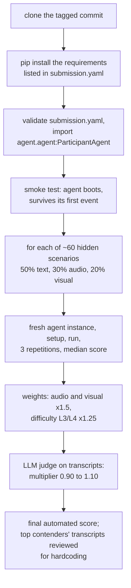

All scenarios run in **one Python process** (organizers confirmed): only the
first scenario pays model loading; our models stay cached. `setup()` has 300 s;
each scenario has a 300 s wall clock (ours take about 10 s).

### How the jury weighs everything (official, FAQ Q22)

| Criterion | Weight | Where we stand |
|---|---|---|
| Working prototype & functionality | 30% | Strong: 97.4 public, 100 on randomized scenarios, degrades gracefully. |
| Technical depth & feasibility | 25% | Strong: six mechanisms, invariants, measured decisions, frugal compute. |
| Innovation & originality | 20% | Epoch-versioned action safety, typed ids, testing the tests - a framing no shipping assistant has. |
| Relevance to theme | 15% | Built directly on the theme's objectives 1-6. |
| Presentation & documentation | 10% | README, deck, findings; the video is not recorded yet. |

The FAQ adds that the jury considers whether the approach is **sound, useful to a
real user, and could become a PRISM worklet**, and that **resource usage** (run
time, GPU requirement, model size) is factored in.

### The demo round (15 October, top 15 announced 9 October)

Teams present live, **walk the jury through the working prototype**, and answer
questions on design decisions and trade-offs. That is why a live, interactive
way to talk to DUET matters (section 13).

---

## 12. Where we stand against Samsung's specifications

### Interface and rules

| Requirement | Source | Status |
|---|---|---|
| Python 3.10-3.12, in-process class | PROTOCOL 7 | OK - but we develop on 3.11 and declare 3.12; **3.12 is untested** (do it on the GPU box) |
| `__init__(in_q, out_q)`, `async setup()`, `async run()` | PROTOCOL 5 | OK |
| Never block the event loop | PROTOCOL 5.1 | OK - 0.47 ms worst |
| `setup()` under 300 s | PROTOCOL 5.3 | OK - about 10 s to load and warm on the 3060 |
| Per-scenario wall clock 300 s | FAQ Q33 | OK - about 10 s |
| Own `call_id` on every tool call | PROTOCOL 2.2 | OK |
| `state_snapshot` on every final response | PROTOCOL 2.5 | OK, on every spoken action |
| No duplicate state-modifying calls | SCORING 4 | OK - ledger; 0 in every run |
| Filler budget (4, sometimes 3) | SCORING 4 | OK - lint enforced |
| No premature completion claims | SCORING 4 | OK - stricter than the scorer |
| Tools from the manifest only | TOOLS 1 | OK - grep test |
| No `ground_truth`, scenario ids or timestamps read | README rules | OK - grep test |
| Deterministic across repetitions | SUBMISSION | OK - tested in one process |
| Public PyPI dependencies | SUBMISSION | OK - all pinned |
| Public or shared GitHub repo | FAQ Q17 | Pushed, private: **must be shared with the organizers** |
| README with reproducible setup + Docker | FAQ Q17 | README done; **Dockerfile never built** |
| Demo video, 5 minutes max | FAQ Q17 | **Not recorded** (script ready) |
| PPT/PDF named CollegeName_TeamName | FAQ Q21 | Done: `SRM_SE7EN` |
| Release tag on the final commit | FAQ Q19 | Deliberately not yet |

### Theme objectives (Theme 05 guide)

| Objective | Status |
|---|---|
| 1. Floor management - fast, no false claims, no filler spam | Done |
| 2. Interruption recovery - prompt cancel, updated state, clean re-plan | Done |
| 3. Session slot tracking with localized corrections | Done (M3) |
| 4. Schema-driven tools, no duplicate state-changing calls | Done |
| 5. Multimodal grounding - process audio/frames behind acknowledgments, clarify ambiguity | Audio done; **visual naming partial** |
| 6. Protocol compliance | Done |

### What the hidden set is described as containing, and our readiness

| Hidden-set feature (WALKTHROUGH 4) | Readiness |
|---|---|
| ~10 unseen tools, schema only, some state-modifying | Tested with our randomized unseen-tool templates: 100 |
| Interruptions during chains, near completion, twice, retractions, topic changes | Tested (conf_01-04, conf_19-23, templates): 100 |
| Re-skinned public scenarios, different cities and names | Tested (randomized pools): 100 |
| Paraphrases | Tested (conf_09-18, templates): 100 |
| Frames without `device_hint` | Tested (conf_05): 81.5, same as with the hint |
| Longer and noisier recordings | **Untested** - we only have the kit's four clips |
| Distractor speech that should not trigger a tool | **Not handled** - we act on any speech we hear |
| LLM quality judge | Linted mechanically; **never graded by an LLM** |

### Where we could be off, and why

1. **Visual scenarios that ask "what is this?"** lose about 18.5 points each
   (81.5), because we will not name a component we cannot identify. If most
   hidden visual scenarios are like pub_07, visual averages around 81-85; if
   they name the thing in words ("why is this light blinking?"), text-keyword
   retrieval already finds the right page.
2. **Distractor speech.** If a clip contains a second voice or background TV
   saying "book a flight to Paris", DUET transcribes it and may act on it. We
   have no speaker separation. This is the biggest *unknown* in audio.
3. **Noisier audio.** Our thresholds were calibrated on four clips. A known gap
   (F21): if noise swallows the repair word ("actually"), the abandoned city can
   win.
4. **The quality judge.** Our transcripts are clean by every mechanical check,
   but no LLM has graded them. The multiplier (0.90-1.10) could move the final
   score by several points either way.

A reasoned (not measured) expectation for the hidden automated score: text in
the 90s, audio 80-95 depending on distractors and noise, visual 81-95 depending
on how many are pointing questions - overall roughly **high 80s to mid 90s**
before the quality multiplier. There is no leaderboard, so this cannot be
checked before results.

---

## 13. Can someone use it right now? On a Samsung phone?

### Honestly: as a simulator, yes. As a talking assistant, not yet.

What exists and works today:

- Run any scenario and watch DUET respond, live, on the real clock.
- **Write your own scenario** - typed turns, interruptions, your own recorded
  MP3/WAV, your own photo, even your own tools as a manifest - and run it.
- Read the linted transcript, and render an HTML timeline of the run.

What does **not** exist yet: a microphone, text-to-speech or UI adapter. You
cannot pick up a microphone and talk to it. That was Phase 4 (live mic with
barge-in, and a judge sandbox), which we cut down to protect the graded score.
For the 15 October demo - where the jury expects a walk-through of the working
prototype - an interactive way to talk to it is strongly advisable. The
cheapest is an interactive text console (type turns; type an interruption while
a tool is running; watch cancels happen). A microphone adapter is the full
version.

Example: your own scenario file.

```json
{
  "scenario_id": "my_test",
  "tool_manifest": {},
  "events": [
    {"timestamp_ms": 100, "event_type": "user_speech_chunk",
     "payload": {"text": "Find me flights to Lisbon ", "end_of_turn": false}},
    {"timestamp_ms": 800, "event_type": "user_speech_chunk",
     "payload": {"text": "for Saturday.", "end_of_turn": true}},
    {"timestamp_ms": 1600, "event_type": "interruption",
     "payload": {"text": "Actually, make it Madrid."}}
  ],
  "ground_truth": {"checkpoints": []}
}
```

```bash
python run_local.py --scenario my_test.json --agent agent.agent:ParticipantAgent
python tools/quality.py --show --scenarios my_test.json
python tools/timeline.py my_test.json
```

(For audio, use `user_audio_chunk` with `"audio_ref": "path/to/clip.mp3"`; for a
photo, `video_frame` with `"image_ref": "path/to/photo.png"`.)

### On a Samsung phone: not as it is - but the architecture transfers

DUET today is a Python process on a PC or server with a GPU, driven by
Samsung's harness. There is no Android app, and the Python process would not run
on a Galaxy phone as is.

What *does* transfer is the valuable part. The coordination core (epochs, the
commitment gate, the ledger, repair handling, manifest-driven tools) uses **no
models at all** - it is pure logic over "events in, actions out". On a phone:

- the speech layer would be the phone's own on-device speech recognition
  (Galaxy AI / Bixby) instead of Whisper;
- the tools would be Bixby capsules or SmartThings device actions, described as
  manifests - DUET already handles tools it has never seen;
- the core would be ported to Kotlin/C++ or run as a cloud service next to
  Bixby.

That is the "PRISM worklet" story in the deck: DUET as the layer that lets Bixby
survive the user changing their mind while it is acting on a device.

---

## 14. How to run it

```bash
# setup (Python 3.10-3.12)
pip install -r requirements.txt
# Windows with an NVIDIA GPU: the CUDA build of the same torch first
pip install torch==2.10.0 torchvision==0.25.0 --index-url https://download.pytorch.org/whl/cu128
python tools/prefetch.py                         # optional: download all pinned models now

# the official procedure (what Samsung runs, on the public scenarios)
python eval_submission.py . --time-scale 1       # one repetition
python eval_submission.py . --reps 3             # three repetitions, median

# one scenario, live
python run_local.py --scenario scenarios/pub_02_text_interrupt.json --agent agent.agent:ParticipantAgent

# our checks
python -m pytest tests/ -q                       # 373 tests, ~7 min
python tools/quality.py --show                   # every transcript, linted (32 scenarios)
python tools/chaos.py --templates all --n 120 --seed 12345   # randomized, pick a NEW seed
python tools/killswitch.py                       # every model off: must stay >= 55
python tools/timeline.py tests/conformance/conf_23_correction_inside_commit_hold.json
python tools/bench.py                            # dispatcher latency

# switches
DUET_NO_ASR=1 / DUET_NO_VISION=1 / DUET_NO_EMBED=1   # force the fallbacks
DUET_ASR_DEVICE=cpu                                  # force CPU speech
DUET_VISION=1                                        # enable the vision model (off by default)
DUET_DEBUG=1                                         # internal log to stderr
```

Always trust `--time-scale 1` numbers. Scale 8 speeds up the scenario clock but
not our computation, so audio looks eight times slower than it is (F9).

---

## 15. GPU runbook: what to do when you get the A100

Goal of the session: prove the package on Linux + GPU exactly as Samsung will
run it, and settle the vision question. Budget about 2 hours.

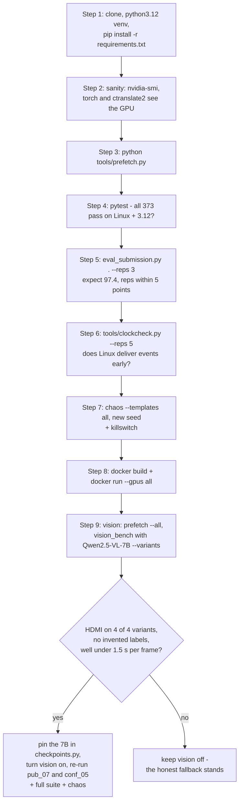

Step by step:

1. `git clone <repo> && cd <repo> && python3.12 -m venv .venv && source .venv/bin/activate && pip install -r requirements.txt`
   (torch 2.10.0 from PyPI on Linux is the CUDA 12.8 build - about 2.5 GB).
2. `nvidia-smi` (driver must support CUDA 12.x - version 525 or newer), then
   `python -c "import torch, ctranslate2; print(torch.cuda.is_available(), ctranslate2.get_cuda_device_count())"` - both should report the GPU.
3. `python tools/prefetch.py` - all pinned revisions must resolve.
4. `python -m pytest tests/ -q` - this is also our **first Python 3.12 run**.
5. `python eval_submission.py . --reps 3` - expect 97.4 weighted and a clean
   verdict; check each scenario's three repetitions agree.
6. `python tools/clockcheck.py --reps 5` - if Linux never delivers events early,
   the 20 ms speech floor was a Windows-only fix (keep it anyway; it is harmless).
7. `python tools/chaos.py --templates all --n 120 --seed <new>` and
   `python tools/killswitch.py`.
8. `docker build -t duet . && docker run --gpus all duet` - the Dockerfile has
   never been built; this is its first test.
9. Vision: `python tools/prefetch.py --all`, then
   `python tools/vision_bench.py --model Qwen/Qwen2.5-VL-7B-Instruct --variants`.

**What the GPU session changes:**

| Item | Impact |
|---|---|
| Linux + Python 3.12 + Docker verified | Removes the largest remaining packaging risk. |
| Clock check on Linux | Tells us whether local latency jitter (F8) exists on the real platform. |
| 7B vision, if it passes | pub_07 and conf_05 go from 81.5 to 100; public weighted goes from 97.4 to 100; on the hidden set, up to about +4 weighted points if visual scenarios are mostly pointing questions. Cost: ~16 GB VRAM, a slower first setup, and a model that must still be honest when unsure. |
| 7B vision, if it fails | We keep the honest fallback and say so in the demo - "we measured it and it was not good enough" is a strong answer on technical depth. |

If the 7B is adopted, `duet/perception/checkpoints.py` gets the new repo and
commit, `VISION_MODEL_ENABLED` is turned on by default in `config.py`,
`requirements.txt` needs nothing new, and every check above is re-run.

---

## 16. Other things worth understanding

**Why tests of tests.** A scenario that passes whether or not the agent cancels
anything proves nothing. `tests/test_conformance_discriminates.py` runs two
probe agents - one that cancels, one that does not - and asserts each
interruption scenario fails the second and passes the first, reading the timing
margins straight from the trace.

**Why the score cannot be trusted alone.** Three of today's worst bugs scored
100: a garbled capabilities answer (found by reading transcripts), a flight id
sent to `cancel_booking` (found by drawing a timeline), and "for Priya, not Alice"
making Alice the destination (found by the transcript lint). Hence
`tools/quality.py` and `tools/timeline.py`.

**The rule against hardcoding.** If a change improves the nine public scenarios
but worsens randomized ones, it is a hardcode and gets reverted. The organizers
review top submissions manually for scenario-specific code.

**Difficulty levels.** Scenarios are tagged L1-L4; L3/L4 count 1.25 times.
Audio and visual count 1.5 times. By weight, audio + visual are 60% of the
hidden set.

**Determinism.** Phrasings rotate in a fixed order, decoding is greedy (Whisper
temperature 0), tool delays are seeded by the harness. Same input, same output -
which matters because the sealed run takes the median of three.

**Session-scoped state.** Each scenario gets a fresh agent; only the loaded
models are shared (module-level cache), and a test proves repetitions in one
process behave identically.

**The repository map** - `agent/` entry point; `duet/` engine; `tests/` (373);
`tests/conformance/` our 23 scenarios; `tools/` chaos, lint, timeline,
killswitch, bench, clock check, vision bench, prefetch, generators, deck;
`notes/` analysis, plan, findings F1-F24, organizer answers, video script;
`harness/ scenarios/ docs/ run_local.py eval_submission.py` the organizers' kit,
unchanged.

**Findings you should be able to explain in the meeting:** F3 (cancelling is
free, stale completions are not), F8 (the clock artifact), F14/F17 (per-word
confidence and the production model), F15 (the phantom final), F16 (the CUDA
13 trap), F18 (why vision is off), F19 (claim patterns keyed by tool name), F23
(our own randomized templates), F24 (typed ids).

---

## 17. Questions for the Samsung mentors

Each question says why we are asking and what we would do with the answer.

### A. How we will be scored

1. **How does the hidden-scenario score map into the published criteria?** The
   FAQ lists "working prototype & functionality 30%"; the kit describes ~60
   hidden scenarios with medians and weights. Is the automated score the
   dominant input to that 30%, or one factor among demo and documentation?
   *Tells us how much time to put into scenario robustness versus the demo.*
2. **FAQ Q23 says it is not explicit whether unseen scenarios are used - the kit
   says ~60 hidden ones. Which is current?**
3. **The LLM quality judge:** does it see every spoken action (fillers,
   clarifications) or only final responses? Does it see tool calls? Is asking a
   clarifying question ever marked down for relevance?
4. **"Resource usage is factored in" - how exactly?** Setup time, VRAM, model
   size, per-scenario run time? Our active footprint is about 2-3 GB. Would
   adding a 16 GB vision model for a few visual points be penalized?
   *Directly decides the 7B vision question.*

### B. Expected behaviour where the docs are silent

5. **Distractor speech:** what does it sound like - a second speaker, a TV,
   overlapping speech? Should the agent stay completely silent, or acknowledge
   and do nothing? Is speaker separation expected? *Our biggest audio unknown.*
6. **"What is this port?" with several components visible:** if the agent cannot
   identify it with confidence, is asking which one (with the candidate manual
   pages) acceptable and credited, or must it always commit to one component?
7. **After a retraction ("never mind"), what should the state snapshot contain?**
   Cleared slots? An intent value? There is no public ground truth for it.
8. **A state-modifying tool times out:** preferred behaviour - verify with a
   read-only call, or tell the user and ask? TOOLS.md allows both.
9. **Several final responses in one scenario** (a revised answer) - allowed by
   the protocol, but does the quality judge penalize them?
10. **For unseen state-modifying tools, are completion-claim patterns supplied
    per tool in the hidden ground truth?** We currently phrase completions of
    unknown tools neutrally to avoid matching another tool's pattern.

### C. The evaluation environment

11. Please confirm: **Linux x86_64, Python 3.12, NVIDIA driver 525 or newer, and
    pip installing from the default PyPI index** (our pinned torch 2.10.0 is the
    CUDA 12.8 build from PyPI).
12. **Model downloads:** is download time excluded automatically inside
    `setup()`, or should we name a prefetch command? Are cached downloads reused
    across the three repetitions?
13. **On Linux, are events delivered at their declared timestamps?** On Windows
    we saw early delivery of up to 9 ms and added a 20 ms speech floor.
14. **Sharing a private repository:** which GitHub account should we add, and
    does the portal clone the tagged commit from our link?

### D. Direction and the demo round

15. **Would the jury value a language model in the planning loop** (innovation)
    over deterministic rules (reliability, latency)? We chose rules - is that the
    right call for this theme?
16. **The docs encourage Gemini and Gemma.** Is there any credit for using them,
    or is a local open-weight stack valued equally?
17. **For 15 October:** is a live voice demo (microphone, barge-in) expected, or
    is a replay and timeline walk-through enough? May we show interface code
    added after the tag, if the graded agent is unchanged?
18. **The PRISM worklet angle:** which Samsung surface fits best - Bixby voice,
    SmartThings device control, on-device Galaxy AI? Would on-device feasibility
    count under "technical depth & feasibility"?
19. **Is our framing right for Theme 05** - a coordination layer that makes
    *actions* safe to interrupt - or does Samsung expect an end-to-end
    speech-to-speech approach?
20. **How strict is the manual hardcoding review?** Our engine uses general
    English vocabularies (repair words like "actually", "never mind"; verbs like
    "book", "reserve") but no tool names, cities or scenario identifiers. Is that
    acceptable?

---

## 18. What remains before submission

| # | Task | Owner | Notes |
|---|---|---|---|
| 1 | Send the organizer follow-up (CUDA/driver, downloads, Linux, demo code) | Team | Draft in `notes/ORGANIZER_CLARIFICATIONS.md` |
| 2 | Share the private repo with the organizers | Team | FAQ Q17 allows "shared" |
| 3 | GPU session: Linux, Python 3.12, `--reps 3`, Docker build, clock check, 7B vision bench | Team + engineering | Section 15 |
| 4 | An interactive way to talk to DUET for the demo (text console; microphone if time allows) | Engineering | Section 13 |
| 5 | Record the video (5 minutes max) | Team | `notes/VIDEO_SCRIPT.md` |
| 6 | Refresh numbers in README, PROJECT.md and the deck after the GPU session | Engineering | `tools/deck/build_deck.js` |
| 7 | 25 September: freeze at noon, final checks, tag `PRISM_GENAI_HACKATHON_Y2026`, push the tag, submit | Team | The tagged commit is what is judged |
